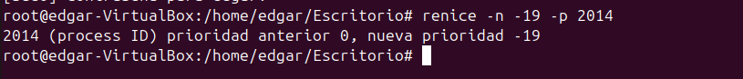

Introducció

En aquest sprint aprendrem a gestionar els usuaris, grups i permisos dins d’un sistema Linux. A més, configurarem polítiques de seguretat tant per als comptes d’usuari com per al sistema en general. També instal·larem i ajustarem serveis i processos essencials del sistema operatiu, i treballarem amb sistemes de fitxers i noves particions. A més, implementarem un sistema de còpies de seguretat i, per finalitzar, farem proves per assegurar-nos que tot funciona correctament.

Gestió de processos

Comencem definint què és un procés: es tracta d’un programa que s’està executant i que inclou el seu propi codi, els recursos que té assignats i el seu estat d’execució. Els processos en Linux poden funcionar en primer pla o en segon pla. Els que s’executen en primer pla requereixen la interacció directa amb l’usuari, mentre que els de segon pla poden funcionar sense necessitat d’aquesta interacció.
Una de les primeres ordres que farem servir per visualitzar els processos és pstree. 

Aquesta comanda ens mostra els processos actius en forma d’arbre, indicant quins són els processos principals i quins en depenen, si n’hi ha.

pstree

Amb la mateixa comanda si volem saber a l'usuari que correspon i a quin número de procés tenim ho podem realitzar amb les lletres h (usuari) i p (procés).

pstree -p -h usuari

A continuació veurem com matar un procés, per això serà necessari saber quin número de procés li correspon a cadascun d'aquestos. En el cas de matar un procés pare tots els processos fills haurien de morir, tot i que hi ha una possibiltat de que algún quedi viu, i aquestos s'anomenen zombies.
Per matar un procés utilitzarem la seguent comanda i el número de procés:

kill -9 (PID)
Per fer la prova he utilitzat un altre terminal i m'he guardat el seu PID, per matar el procés tal i com es demostra a continuació:

La comanda anterior fa una imatge dels processos, aquestos no canvien en temps real, per fer una consulta d'aquest tipus utilitzarem la comanda "top".

top

Aquesta comanda ens dona molta informació per columnes, i ara veurem que vol dir cada columna. PID: Identificador únic del procés. USER: Usuari que inicia el procés. %CPU: Percentatge d'ús del processador. %MEM: Percentatge d'ús de la memòria RAM. COMMAND: Nom de la comanda o programa.

En cas d'obrir un nou procés (ex: firefox ) aquest ens apareixerà.

La prioritat no es pot modificar directament, però amb el NI (nice) si que es pot canviar, contra mes baix es el número més prioritat té. Això es pot fer amb la següent comanda. Val a dir que caldria fer-ho des de el root ja que com sabem ens otorga més privilegis.

renice -n -nºprioritat -p PID

Aquesta comanda serveix per moments determinats la prioritat per renice no es permanent. - Seguidament també podem utilitzar la comanda "ps aux" que ens dona una informació similar però amb diferents parametres que veurem a continuació: USER: Usuari que ha iniciat el procés. PID: Identificador únic del procés. %CPU i %MEM: Percentatge de CPU i memòria RAM utilitzats pel procés. VSZ: Memòria virtual total utilitzada pel procés. RSS: Memòria física utilitzada pel procés. TTY: Terminal associat al procés ( ? si no en te). STAT: Estat del procés. R Executant-se (Running). S = Inactiu. T = Pausat. Z = Procés zombi. I = Inactiu o sense consumir recursos. < = Alta prioritat de CPU. s = Líder de sessió. l = Multithread. + = Associat al terminal en primer pla.

- Amb el ps podem fer varies combinacions per mostrar informació en concret a continuació veurem quines són i que fan.

ps -e
- Mostra tots els procesos del sistema amb una sintaxis estandar.

ps -ejH
- Mostra un arbre de procesos-

ps -eLf
- Mostra la informació dels fils (threads).

ps -eM
- Mostra informació de seguretat

ps -U
- Mostra tots els processos de root.
A continuació veurem que són els processos amb segon pla i com passar processos a aquest estat. Com hem dit abans amb el kill -9 matem un procés i amb el ctrl+c l'aturem i amb el ctrl+z si que el passariem a segon pla. (Nota: segons el tipus de procés que aturem, si aquest va per terminal igaul no se'ns mostra en segon pla).
La comada per veure els processos en segon pla es la següent.

jobs

Un cop tenim aquest procés localitzat i no volem matar-lo sino que el volem enviar al primer pla podem utilitzar la següent comanda.

fg %nº 

En cas de voler fer el procés invers i enviar un procés al segon pla podem utilitzar:

bg %nº
En algun cas espacial igual volderm executar algun procés directament amb segon pla, i es pot fer de la seguent forma.

nomproces &
A l'hora de consultar processos amb top em vist que es una eina en viu i que els processos que volem consultar es van movent i, a vegades se'ns pot fer complicat llegir-lo. En cas de voler evitar això i sol consultar el PID d'un procés en concret podem fer servir la següent comanda.

pgrep nomproces

Per acabar, si en algun moment volem utilitzar algún script o procés i que aquest tingui una prioritat predeterminada per nosaltres es pot fer amb el nice.

nice -n nºprioritat nomproces