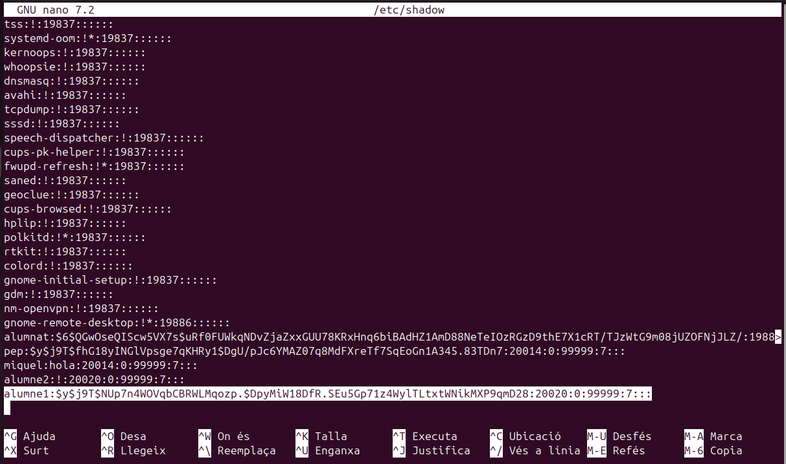
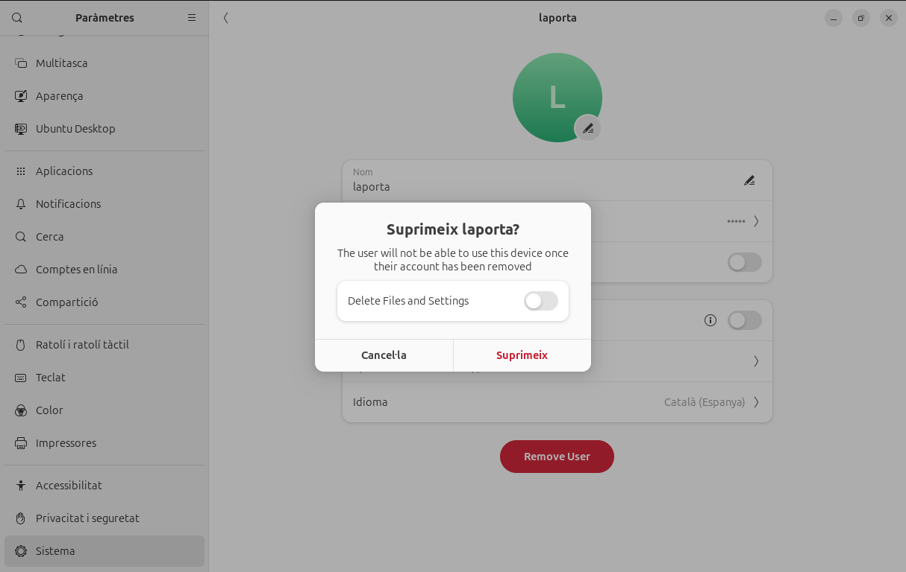
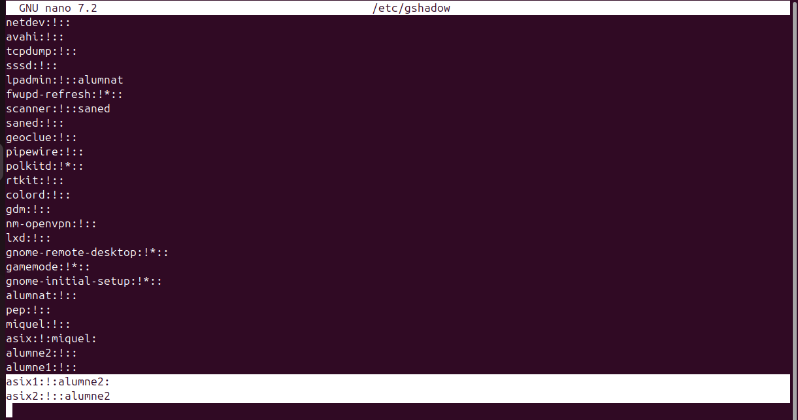
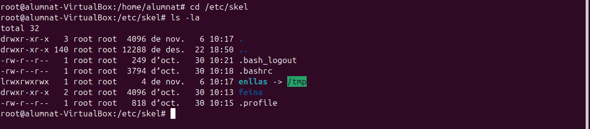
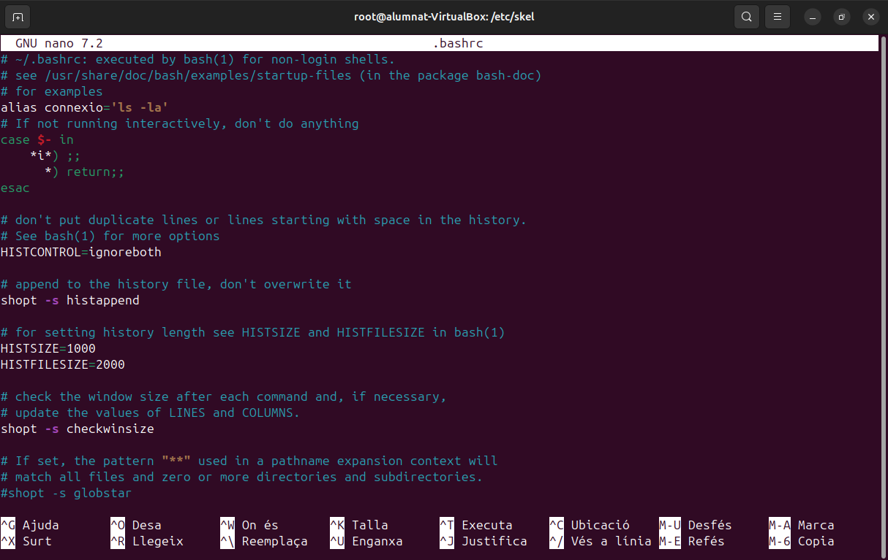
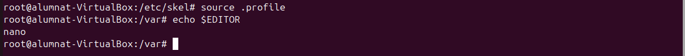

Gestió d'usuaris grups i permisos
Es important que al nostres sistema tinguem diferents usuaris i que aquestos tinguen diferents caracteristiques, i que els puguem incloure en grups per classificar-los. A més a més, també ens interessarà poder modificar-los, eliminar-los i bloquejar-los al nostre gust. Tot això i més ho veurem a continuació.
- Commandes terminal i accessos als directoris
Per a accedir al terminal normalment ho faremt amb un crtl + alt + t, així obrim el pseudo terminal. El terminal com a tal l'obrirem al el ctrl dret + F3, aquest es un terminal TTY. Un pseudo terminal es com un emulador on les comandes que posem son interpretades per algún arxiu al que fan referencia i aquest fa els procediments, en canvi amb un terminal si que estem amb contacte directe amb el sistema.

En primer lloc veurem un document que actua com un registre de tots els comptes d'usuaris presents al sistema. Inclou dades com el nom del compte, l'identificador d'usuari (UID), el directori personal i el shell configurat per defecte. Es tracta d'un fitxer públic, cosa que permet que qualsevol pugui consultar qui són els usuaris del sistema.

nano /etc/passwd

A continuació podem veure els grups dels usuaris i l'identificador de qui es el seu administrador.

nano /etc/group

A continuació, en aquest arxiu es guarda la informació relacionada amb les contrasenyes dels comptes d'usuari. Cada registre fa referència a un usuari i inclou la seva contrasenya codificada. Si apareix el símbol "!", això indica que el compte està deshabilitat i l'usuari no té permís per accedir al sistema.

nano /etc/shadow

Per últim aquest arxiu és comparable a /etc/group, però ofereix detalls extres sobre els grups. En aquest lloc es pot identificar qui són els administradors de cada grup. Resulta pràctic per controlar els permisos i gestionar els privilegis d'accés dels diferents grups d'usuaris.

nano /etc/gshadow

- Creació d'usuaris
Per crear usuaris tenim diverses formes de fer-ho, el més important es tenir clar que amb certes comandes no es creen directoris sol usuaris. A continuació es mostrarà com crear usuaris.

En primer lloc utilitzarem la següent comanda, aquesta ens creara un usuari pero fins que no fessim un log in amb aquest no ens crearà els directoris. Aquesta es la forma més senzilla de crear els usuaris ja que et ve pautada pel propi sistema operatiu.

adduser usuari

 

Per crear un nou compte d'usuari al sistema, farem servir la comanda useradd. Aquesta comanda ens permetrà afegir usuaris al sistema amb diversos paràmetres que ens ajuden a configurar les seves propietats. A continuació, detallem alguns dels paràmetres més destacats que podem utilitzar:
-m: Indica que es generarà automàticament un directori personal per a l'usuari.

-s /bin/bash: Aquest paràmetre ens permet definir el shell per defecte de l'usuari.

-d /home/alumne2: Amb aquest paràmetre, especifiquem el directori inicial de l'usuari. Per exemple, en aquest cas, el directori personal serà /home/alumne2.

alumne2: Correspon al nom de l'usuari que estem creant. En aquest exemple, l'usuari es dirà "alumne2".

&& passwd alumne2: Aquesta comanda s’utilitza per assignar o modificar la contrasenya de l’usuari "alumne".

useradd usuari

 - Sino utilitzem la comanda -m per als directoris els podem afegir de la següetn manera.

mkdir usuari

 

Si volem canviar el nom de l'usuari podem utilitzar la següent comanda. EN el cas que hi ha a continuació volem canviar el nom d'usuari de porva2, ja que hauria de ser prova2.

usermod -l usernou user

En cas de voler eliminar accés a un usari ho podem fer bloquejant-lo, la comanda seria la següent. Una forma de comprovar que s'ha bloquejat correctament es entrar a la carpeta de passwd i veurem que la contrasenya del usuari al davant té un signe d'exclamació "!"

usermod -L usuari

 

- Seguint amb la creació d'usuaris, si tenim un usuari bloquejat i el volem recuperar utilitzarem aquesta comanda. A l'hora de comprovar-ho ens fixarem que ja no te l'exclamació.

usermod -U usuari

 

- Si realment el que volem es eliminar l'usuari de forma més permanent ho farem amb la següent comanda. Per comprovar si l'hem eliminat correctament podem entrar a la carpeta passwd i veurem que l'usuari ja no hi es.

deluser usuari

 

Per complementar una mica les comandes que tenim, aquí en tenim algunes que ens poden ajudar també, la següent elimina la "home" de l'usuari.

rm -r usuari
Un dels problemes habituals es que no eliminem les homes i directoris dels usuaris, amb la següent comanda ho podem fer tot a la vegada.

userdel -r usuari
En cas de voler consultar algun tipus d'informació sobre algun usuari, podem fer-ho així.

id usuari

Un cop vist com es el funcionament a través del terminal podrem observar com es fa per l'interficie gràfica d'Ubuntu. Dins de la configuració de sistema hem d'entrar a l'apartat usuaris, i després seguirem els passos que hi ha a continuació.

 

 

 

 

 
- Creació de grups
En aquest apartat veurem com funcionen els grups d'usuaris, com hem vist anteriorment podem consultar els grups i les seves contrasenyes. Important dir que quan es crea un usuari també es crea un grup amb el nom d'aquest.
Per crear un grup nou ho podem fer amb una senzilla comanda.

addgroup grup

 

 

D'altra banda si el que volem es afegir un usuari a un grup existent ho podem fer d'aquesta manera.

adduser usuari grup

 

  

L'operació anterior també es pot fer amb aquesta comanda.

gpasswd -a usuari grup
Per fer a un usuari administrador d'aquell grup ho podem fer així. Dins de la carpeta gshadow podem veure els usuaris i administradors dels grups, per reconeixels veurem la posició que tenen entre els ":", l'alumne 2 es administrador d'asix1 i membre d'asix2.

gpasswd -A usuari grup

 

 

Un dels majors problemes es que quan afegim usuaris a grups amb les comandes anteriors els treu del grup on estaven, per evitar-ho hem d'utilitzar la següent comanda. Com comprovarem l'usuari alumne2 forma part dels dos grups d'asix i es administrador del primer.

usermod -a -G grup usuari 

 

 

Per eliminar un usuari d'un grup ho farem com veurem a continuació. En aquest cas l'alumne2 ja te prous responsabilitats i l'eliminarem del grup d'asix1.

gpasswd -d usuari grup

 

 

L'anterior comanda també es pot fer amb aquesta altra

deluser usuari grup
 
Per fer un usuari el principal d'un grup en concret utilitzarem el següent.

usermod -g grup usuari
En cas de voler canviar el nom d'algun grup ho farem amb la següent comanda.

groupmod -n grupnou grupvell

 

 

- Configuració de fitxers d'usuari
Com hem vist tenim una serie de comandes per defecte que tenen una serie d'efectes sobre els usuaris que hem creat. Tot això es pot canviar, la seva útilitat resideix en que si volem que els nostres usuaris nous tinguin diferents directoris o inclús politiques de contrasenyes diferents. Ara veurem com es modifiquen els següents arxius.
El primer arixu que modificarem es el /etc/default/useradd que ens permet establir els valors predefinits per als nous usuaris, com la ruta del directori personal i el shell per defecte. Per configurar-lo utilitzem la següent comanda.

nano /etc/default/useradd
Els parametres que es poden modificar son els següents:
GROUP: Especifica el grup que s'assignarà com a grup principal per defecte als nous usuaris. Si està comentat o no existeix, el sistema crea un grup nou per a cada nou usuari amb el mateix nom que l'usuari.
HOME: Defineix la ruta base per als directoris de casa dels nous usuaris. Per defecte, és /home. Si vols canviar la ubicació dels directoris de casa, pots modificar aquest paràmetre.
INACTIVE: Estableix el nombre de dies després dels quals una contrasenya expirada passarà a estar inactiu si no es canvia. Un valor de -1 desactiva aquesta funcionalitat.
EXPIRE: Data en què l'usuari expira, en format AAAAMMDD. Si està comentat o no s'especifica, l'usuari no expira mai.
SHELL: Indica el shell per defecte per als nous usuaris. El valor predeterminat és /bin/sh, però es pot canviar a /bin/bash o qualsevol altre shell disponible.
SKEL: Especifica el directori des del qual es copiaran els fitxers de configuració per defecte quan es creï un nou usuari. El valor predeterminat és /etc/skel.
CREATE_MAIL_SPOOL: Si està establert a "yes", es crearà una carpeta de correu per a l'usuari nou. Per defecte, està establert a "yes". 

 

Aquestes son unes possibles modificacions (d'exemple) 

 

Un altre fitxer que podem modificar es el de la politica de contrasenyes que es aquest /etc/login.defs

nano /etc/login.defs
Els parametres que ens permet modificar son:
MAIL_DIR: Defineix l'ubicació del directori d'emmagatzematge de correu per als nous usuaris. Per defecte, és /var/mail.
PASS_MAX_DAYS: Nombre màxim de dies que una contrasenya pot ser vàlida. Per defecte, pot ser 99999, el que significa que no expira mai.
PASS_MIN_DAYS: Nombre mínim de dies entre canvis de contrasenya. Per defecte, és 0, el que permet canvis immediats.
PASS_MIN_LEN: Longitud mínima de la contrasenya; no obstant això, en sistemes moderns, aquest paràmetre pot no tenir efecte, ja que la complexitat de la contrasenya es gestiona amb PAM (Pluggable Authentication Modules).
PASS_WARN_AGE: Nombre de dies abans de l'expiració de la contrasenya que es notifica a l'usuari. Per defecte, és 7.
UID_MIN i UID_MAX: Rangs mínim i màxim per als identificadors d'usuari (UID) per als nous usuaris. Això ajuda a assegurar que no es creïn usuaris amb UID que podrien entrar en conflicte amb comptes del sistema o altres usuaris.
GID_MIN i GID_MAX: Rangs mínim i màxim per als identificadors de grup (GID) per als nous grups.
CREATE_HOME: Si està establert a "yes", es crea el directori de casa de l'usuari quan es crea un nou compte; si no, no es crea. Per defecte, pot ser "no" en alguns sistemes per raons de seguretat o per configuracions específiques.
ENCRYPT_METHOD: Mètode de xifrat utilitzat per a les contrasenyes. Pot ser SHA512 o altres mètodes segons la versió del sistema.
UMASK: Defineix el valor per defecte de la màscara de permisos per als fitxers creats pels usuaris, afectant els permisos per defecte dels fitxers i directoris.
USERGROUPS_ENAB: Si està establert a "yes", quan un usuari es suprimeix, el seu grup principal també es suprimeix si no hi ha altres membres en aquest grup.

 

- Possibles modificacions (d'exemple)

  

Per últim veurem el directori /etc/skel, dins d'aquest directori trobarem uns fitxers que son .bashrc .profile i .bash_logout. Aquestos fitxers són scripts de configuració per al shell Bash i Sh que permeten personalitzar l'entorn de l'usuari.

Quan es crea un nou usuari amb un directori home, el contingut d'aquest directori /etc/skel es copia al nou directori home de l'usuari. Això permet configurar arxius i directoris per defecte per a tots els nous usuaris.

 

.bashrc:

Aquest arxiu s'executa cada vegada que es crea un nou shell interactiu que no és un shell de login (per exemple, quan obres una nova finestra de terminal). Es pot utilitzar per:

Definir variables d'entorn: Per a variables que no necessiten ser establertes en el context de login.

Ajustar alias: Crear atacs ràpids per a comandaments llargs o freqüents.

Configurar funcions de shell: Afegir funcions personalitzades per facilitar tasques rutinàries.

Personalitzar el prompt: Canviar l'aparença del prompt del terminal.

Establir paràmetres de shell: Com historial, compleció de comandaments, etc.

A continuació un exemple d'us, canviant un "alias". Farem que ll sigui equivalent a la comanda ls -l, així cada cop que posem ll s'executarà un ls -l.

  
  
 

.profile:

Aquest fitxer s’executa automàticament quan l’usuari inicia sessió. Serveix per definir variables d’entorn i aplicar altres configuracions globals. Alguns exemples d’ús són:

Definir variables d’entorn, com PATH.

Configurar el prompt o ajustar altres opcions del shell.

Carregar altres fitxers de configuració, com .bashrc, si existeix.

A continuació un exemple d'us, canviarem l'editor de text per defecte i farem que sigui nano, ja que es el que més utilitzo.

 
  
 

.bash_logout

Aquest fitxer s’executa de forma automàtica quan l’usuari tanca una sessió interactiva. És especialment útil per a:

Alliberar recursos o aturar processos temporals.

Mostrar missatges de comiat o finalització de sessió.

Executar scripts personalitzats per tasques de manteniment.

A continuació configurarem un missatge de sortida.

 
 
 

Gestió de permisos
En els casos d'un sistema multiusuari on vulguem que diferents usuaris tinguin certs permisos però no els mateixos, és important fer una bona gestió d'aquestos. Hi han vaires maneres de gestionar-ho, i les veurem a conitnuació.

- Permisos estandars
Els permisos estandars son una serie de permisos bàsics que es poden donar a tots els usuaris i grups. Els grups poden tenir diferents permisos respecte als usuaris, una forma de comprovar això ho podem fer de la següent forma.

ls -l 

En aquest cas podem observar que el primer root que apareix és de l’usuari i el segon és del grup principal. També surt la data de creació i noms de directori, però la part important és al principi. 

Aquí es on podem apreciar els permisos que hi han dins dels directoris. Després de la lletra d, els primers permisos són els d'usuari "rwx" en aquest cas, això vol dir que por llegir, escriure i executar, bàsicament te tots els permisos. Després els següents permisos son els de grup equivalents a les 3 lletres següents: "r-x", en aquest cas com podem veure no te permisos per escriure. I per últim tenim els ultims 3 caràcters que equivalen a altres, usuaris que no són ni usuari principal ni formen part del grup principal, en aquest cas: "r-x", la mateixa situació que abans no poden escriure però si llegir i executar. Aquest exemple es amb "root".
A continuació veurem com nosaltres podem agregar permisos als usuaris i grups.

chmod -R
Opcions de fitxer/carpeta

chrgp -R
Grup propietari fitxer/carpeta

chown - R
Propietari fitxer/carpeta.
Cada lletra dels permisos te un significat associat: u = usuari, g = grup, o = others, a = all.
- Permisos especials
- Sticky
L'sticky es un permís d'accés per fitxers i directoris. Quan l'apliquem l'únic usuari que el pot canviar es el root. Es pot aplicar de la següent manera.

chmod +t directori

chmod 1775 directori
Això es molt útil en sistemes multiusuari ja que sol el root i l'usuari que ha creat cert directori poden borrar o modificar el directori, els altres sol tenen permisos de lectura o escriptura. En cas de voler eliminar l'sticky podem utilitzar la següent comanda.

chmod -t directori
- sgid
sgid es un permís que esta relacionar amb els grups i principalment permet que qualsevol usuari executi l'arxiu com si fos part del grup al que pertany aquell arxiu. Per utilitzar-la podem fer el següent.

chmod g+s
- suid
suid permet que un arxiu s'executi com si fos el propietari independentment de l'usuari que l'executi. Aquest a diferencia del sgid i sticky no es pot fer un script.

chmod g+s 
- Llistes de control d'accés (ACLs)
Una llista de control d'accés son una serie de regles que ens permeten uns accesos a sistemes de fitxers en aquest cas. Aquestes llistes ens poden donar uns accesos mes restrictius o mes permisius segons la configuarció que faci l'usuari. Per crear una ACL utilitzem la següent comanda.

setfacl

setfacl -m user:usuari:rw- exemple.text

setfacl -m group:grup:rwx carpeta

setfacl -b fitxer o carpeta
Les restriccions venen donades per les lletres com hem vist abans, utilitza la mateixa nomenclatura. Per comprovar si les restriccions s'han aplicat correctament podem utilitzar la següent comanda.

getfacl

Si ens em equicocat a l'hora de configurar alguna ACL podem eliminar totes les excepcions. (TOTES).

setfacl -x usuari carpeta
- Umask
Umask s'utilitza per canviar la mascara del mode de creació d'arxius, auesta determina el valor inicial dels permisos que tindran els arxius que es creein. De forma predeterminada la mascara te el valor dels bits de permís que NO s'han d'establir, per això fem l'operació de negació. Amb les seguents imatges entendrem millor la situació.

 - El que esta fetn umask es una operació coneguda com NOR, el que equivaldria a una resta convencional. - Aquestes operacions es poden realitzar amb la següent comanda, tot i que això sol funcionarà temporalment (els arxius ja creats no canvien de permisos).

umask + nº
- Per a que els canvis siguin permanents tenim que modificar la umask al arxiu que tenim a la següent ruta.

/etc/login.defs
- Un cop obert l'arxiu modifiquem el valor de la umask per defecte i aquest canvi si que es permantent. 
