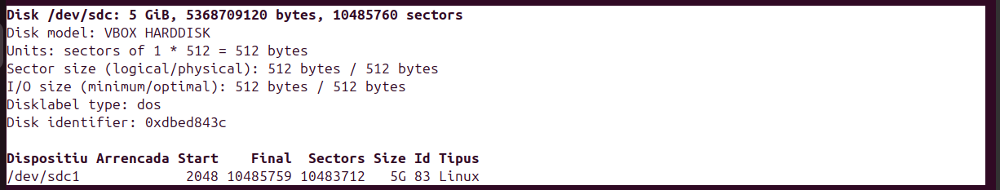
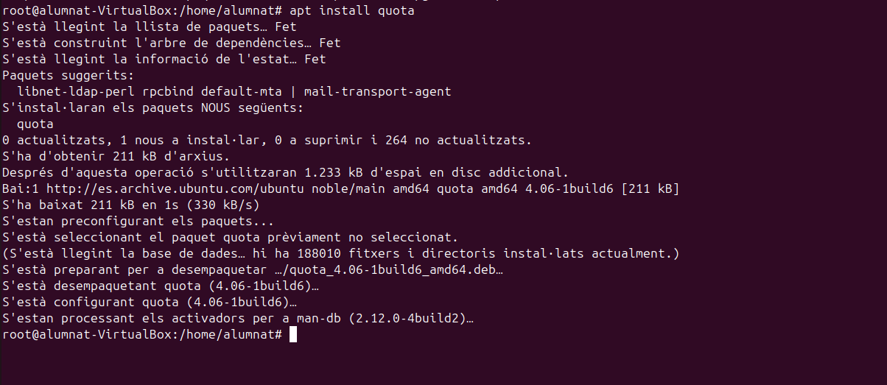
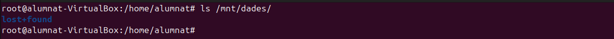
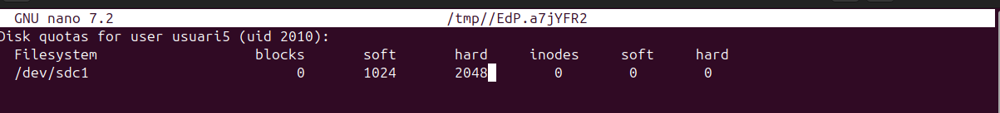
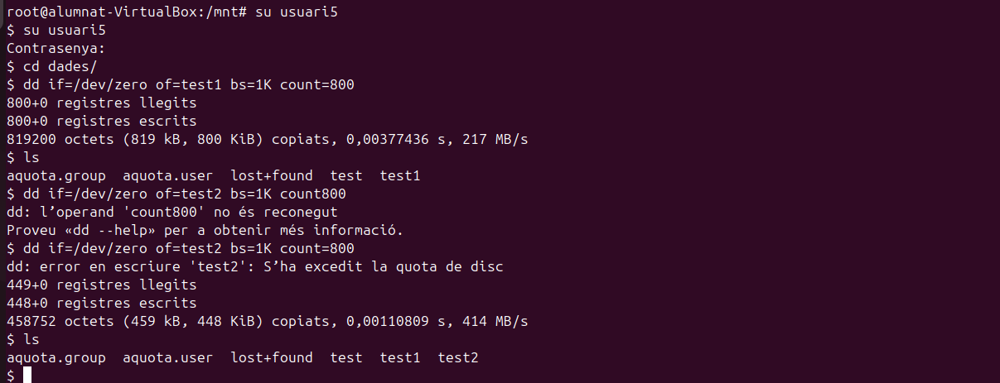

Quotes de disc
Les quotes de disc són unes limitacions imposades a l'ús d'emmagatzematge d'un sistema en aquest cas cas Ubuntu. És poden limitar tant per usuaris com per grups, això es fa per optimitzar l'espai i no fer un malbaratament d'espai. Les quotes es poden modificar en entorns de servidors o ordinadors multiusuari, i els limets pot ser tant de mida com de número de fitxers.

En aquest cas assignarem un disc nou de 5GB per fer proves, com hem vist en passos anteriors fem una partició nova amb tot l'espai del disc i format d'arxius ext4.

Per configurar les quotes de disc haurem d'instal·lar quota.

sudo apt update

sudo apt install quota

Per fer les proves crearem una carpeta "dades"

En aquest punt ens interessarà fer un muntatge permanent i posar les quotes a l'arxiu fstab. Aplicarem quotes d'usuari i de grup. 

A continuació, farem un reinici del sistema i comprovarem el muntatge i afegirem els fitxers de les quotes d'usuari i de grup, i també les activarem. Per provar les quotes assignarem un usuari nou anomenat usuari5. Finalment amb un ls comprovarem que els canvis s'hagin aplicat.

quotacheck -cug /mnt/dades

quotaon /mnt/dades

Per veure les quotes assignades a l'usuari5 podem comprovar-ho de la següent forma.

Com podem veure encara no te cap quota assignada, per fer-ho podem utilitzar la següent comanda.

edquota -u usuari5
 
L'arxiu que modificarem conté aquests parametres:
Filesystem (/dev/sdc1): Aquest és el sistema de fitxers o partició del disc on s'apliquen les quotes.

blocks: Representa l'espai en disc actualment utilitzat per l'usuari en blocs.

soft: 1024 és el límit "soft" d'espai en blocs que l'usuari pot utilitzar. Aquest límit pot ser excedit temporalment, però es recomana no sobrepassar-lo.

hard: 2048 és el límit "hard" d'espai en blocs. Aquest límit no es pot excedir. Si l'usuari intenta utilitzar més espai del que li correspon per aquest límit, no podrà guardar més dades.

inodes:Representa el nombre d'inodes (estructures de dades que representen fitxers) actualment utilitzats per l'usuari.

soft: És el límit "soft" per al nombre d'inodes. No està establert en aquest cas, indicant que no hi ha límit soft per al nombre de fitxers.

hard: És el límit "hard" per al nombre d'inodes. Com amb el límit soft, no està establert.

Seguidament accedirem a l'usuari 5 i modificarem els permisos també afegirem una comanda on pasarà el següent: dd: Es crea un fitxer anomenat test amb dades de /dev/zero de 800 KiB (bs=1K count=800).

dd if=/dev/zero of=test bs=1K count=800
- Per veure un informe detallat del disc i les seves quotes utilitzarem la següent comanmda:

repquota /dev/sdc1

Continuant amb les proves generarem un altre arxiu test per comprovar que passa si superem la cantitat d'emmagatzematge assignada. 

s'ha execedit la quota de disc
Una vegada mes podem utilitzar la comanda quota -u usuari5 per comprovar els següents parametres.

Per acabar també podem modificar els dies de gràcia per defecte.

edquota -t

Per últim comprovarem de forma gràfica que passa si superem el límit de la quota. Per fer-ho descarregarem una foto d'internet i passa el següent. 