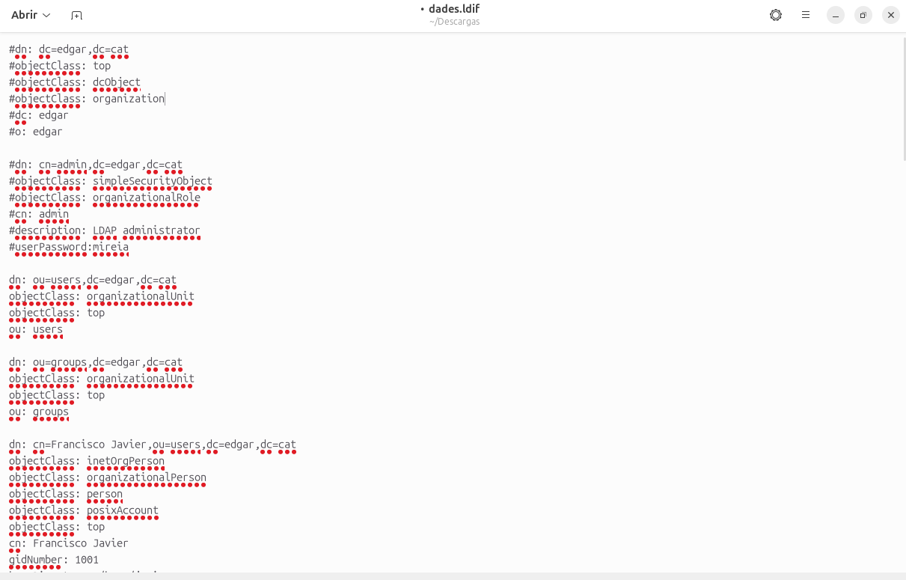
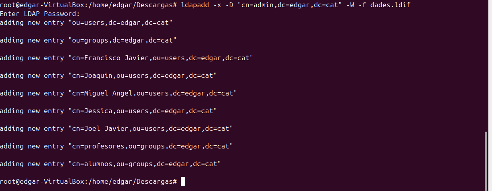

**Gestió del domini**
Per estructurar l'organització i començar a gestionar usuaris, hi ha dues opcions principals: treballar amb fitxers LDIF o utilitzar comandes directament. En aquest apartat, ens centrarem en l'ús de comandes essencials com search, add, modify i delete.

Abans de començar, comprovarem que el domini s'ha creat correctament i després revisarem els fitxers preparats a l'escriptori que contenen informació sobre els usuaris.

**ldapadd**
Tal com es pot observar, el fitxer inclou diverses dades d'usuaris que volem incorporar al sistema. Ho farem utilitzant la comanda ldapadd.

Per registrar els usuaris definits en el fitxer LDIF, executarem la comanda següent:

ldapadd -x -D "cn=admin,dc=edgar,dc=cat" -w -f dades.ldif

Seguidament el que farem sera crear un nou usuari a a mode de prova, mitjançant un fitxer .ldif, el primer que farem serà crear el fitxer:

I seguidament afegim el usuari creat amb la següent ordre:

**ldapsearch**
Un cop els usuaris s'han creat correctament, podem verificar-ne l'existència amb la comanda ldapsearch:

Finalment, realitzem una verificació amb la comanda ldapsearch per assegurar-nos que l'usuari s'ha creat correctament:

ldapsearch -xLLL -b "uid=edgar1,ou=People,dc=edgar,dc=com"

Tambeé afegirem wc -l per fer un recompte de línies, ja que no volem que aparegui tot el text a la sortida.

*Comprovacio de les unitats organitzatives*

Farem una busqueda que ens fara trobar les unitats organitzatives del domini.

ldapsearch -xLLL -b "dc=edgar,dc=com" objectClass=organizationalUnit

*Comprovació de Grups*
Per a comprovar el grups que tenim dintre de la UO Groups, executarem la següent comanda:

ldapsearch -xLLL -b "dc=edgar,dc=com" "(ou=Groups)" dn

*Creació d'una nova UO*
Per crear una nova Unitat Organitzativa (UO) anomenada "asix", necessitem preparar un fitxer .ldif amb la configuració de la nova UO. Un exemple del contingut del fitxer seria el següent:

dn: ou=asix,dc=edgar,dc=com
objectClass: top
objectClass: organizationalUnit
ou: asix

Seguit d'aixo fem un ldapadd per a afegir la UO al domini:

Cuan ja hem completat la creació i l'hem afegit, comprovarem que estigui correctament afegida amb la següent comanda:

ldapsearch -xLLL -b "dc=edgar,dc=com" objectClass=organizationalUnit uo

*ldapdelete*

Hi ha dues maneres de fer esborrats en un domini LDAP: utilitzar la comanda ldapdelete o utilitzar un fitxer .ldif amb ldapmodify.

Esborrar atributs d’un usuari amb ldapmodify
Per esborrar atributs d’un usuari, primer necessitem crear un fitxer .ldif amb les modificacions que volem aplicar. En aquest cas, esborrarem l’atribut roomNumber de l’usuari ejohnson.

Per a acabar el que farem sera fer un ldapsearch per a comprovar que l'atribut roomNumber si s'hagui esborrat
ldapsearch -xLLL -b "uid=ejohnson,ou=People,dc=edgar,dc=com"

Esborrar una entrada amb ldapdelete
Podem utilitzar la comanda ldapdelete per eliminar directament una entrada del domini. Per exemple, per esborrar una unitat organitzativa anomenada "prova":

ldapdelete -x -D "cn=admin,dc=edgar,dc=com" -W "ou=prova,dc=edgar,dc=com"

Esborrar una entrada amb un fitxer .ldif i ldapmodify
També podem crear un fitxer .ldif amb les instruccions d'esborrat. Exemple del contingut del fitxer .ldif:

dn: ou=prova,dc=edgar,dc=com 
changetype: delete
Després, executem la comanda següent per aplicar l'esborrat:

ldapmodify -x -D "cn=admin,dc=edgar,dc=com" -W -f dades.ldif

Ara passarem a fer mes comprovacions, en aquest cas modificacions, el que farem sera afegir un mail i remplaçar el numero de telefon a l'usuari edgar1

