**Entorns gràfics**

En aquest apartat veurem com configurar un LDAP amb interficie gràfica en aquest cas he escollit Apache Directory Studio perqué és intuitiu i senzill.

**Apache Directory Studio**

En primer lloc, ens descarregem l'apliació de la pàgina oficial. Després l'únic que hem de fer es descomprimir el paquet i executar-lo.

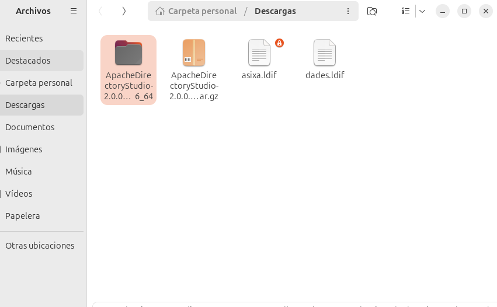

Un cop dins buscarem la connexió que tenim del LDAP i fem login amb les nostres credencials, llavors afegirem noves entrades, aquestes poden ser creades des de zero o amb plantilles, en aquest cas he escollit fer-ne una amb una plantilla per crear un nou usuari. Com podrem comprovar els usuaris que hem creat en els passos anteriors estan presents a la nostra estructura.

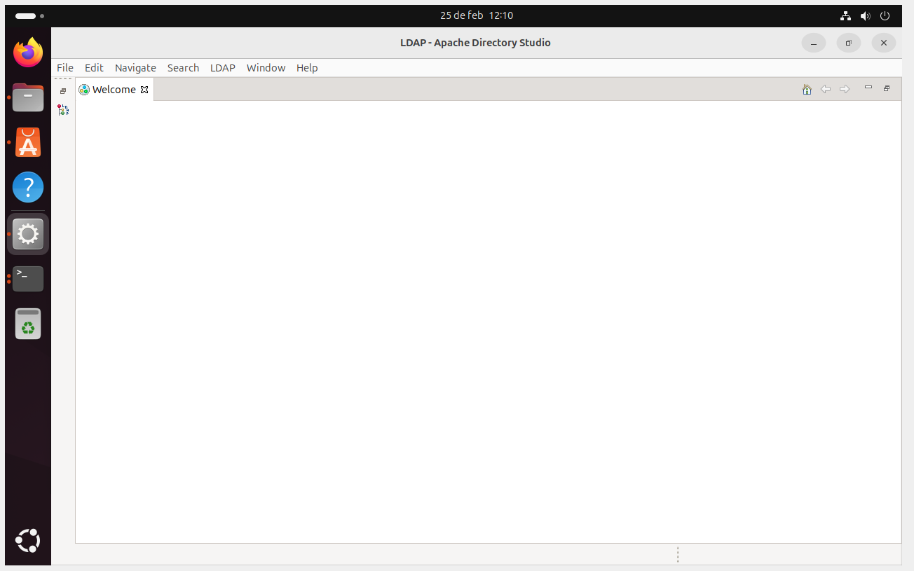
 
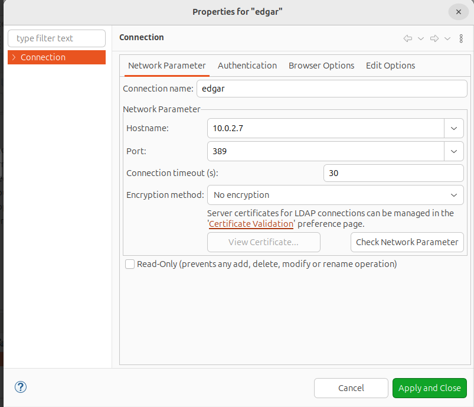

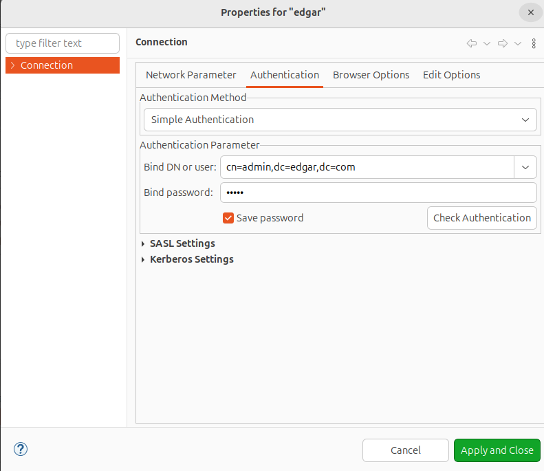

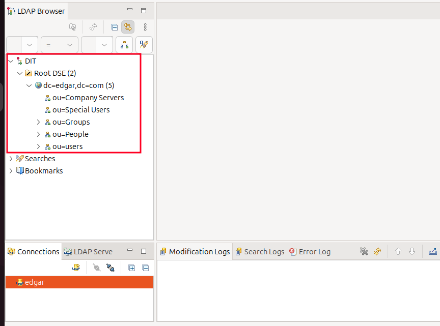

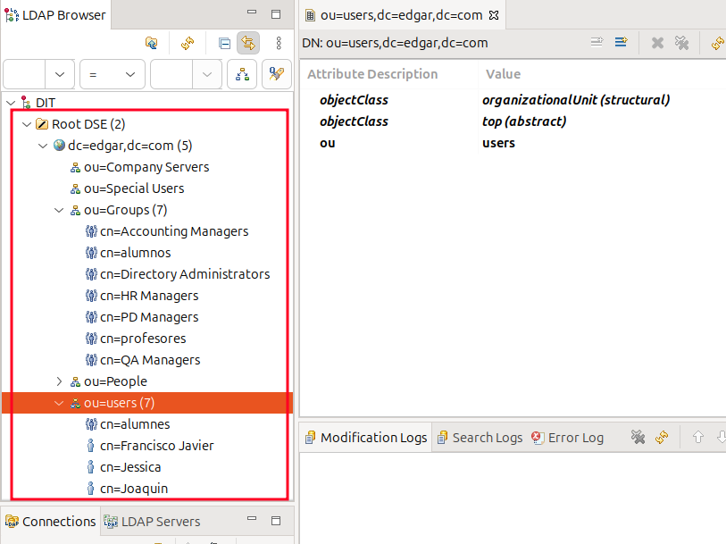

Un cop afegit i comprovat que es correce afegirem una nova entrada al nostre domini.

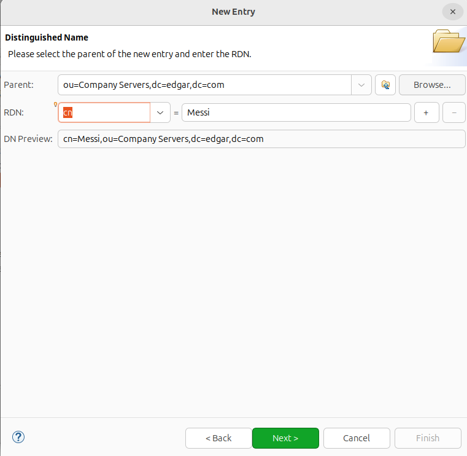

També afegirem les classes del objecte agregat.

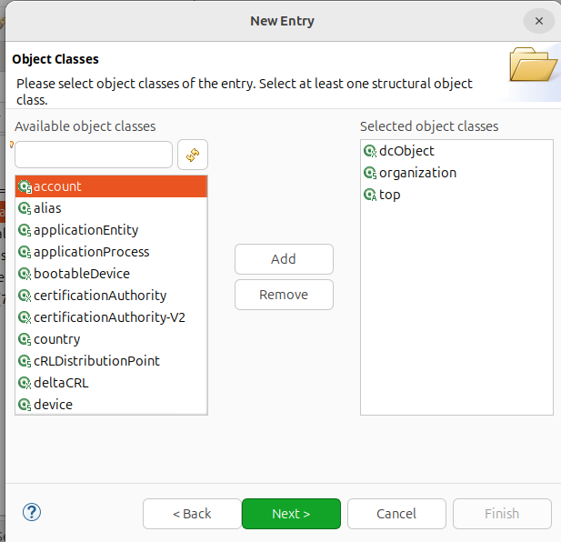

I per a finalitzar el que afegirem seran els atributs per a que l'usuari pugui ser utiitzat.

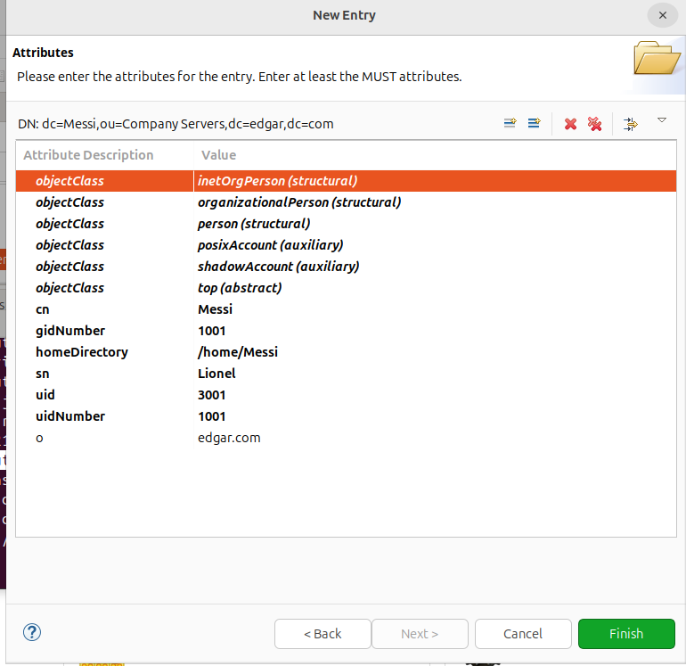

Comprovem que s'hague creat correctament.

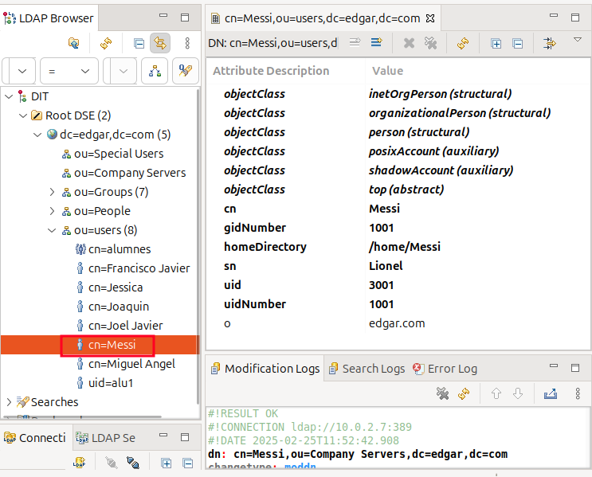

En aquest cas he escollit la carpeta compartida de perfils per crear la home. I després he donat una contrasenya i el /bin/bash per al loginshell.

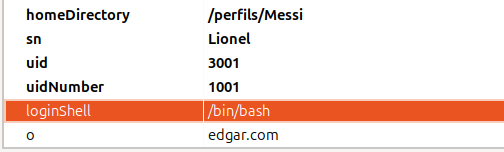

Per entrar amb el client amb l'usuari nou hem d'escollir l'opció de no esteu llistat i allà posem les nostres credencials i ens crearà la home al directori escollit, després podrem entrar i comprovar que estem amb l'usuari correcte.