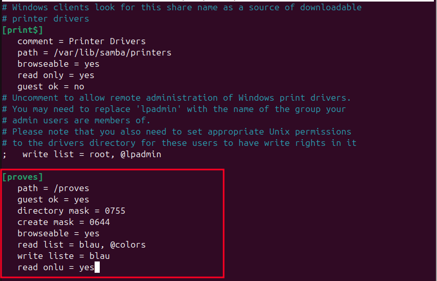
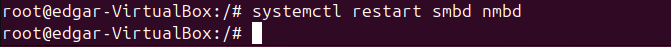
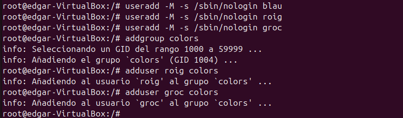
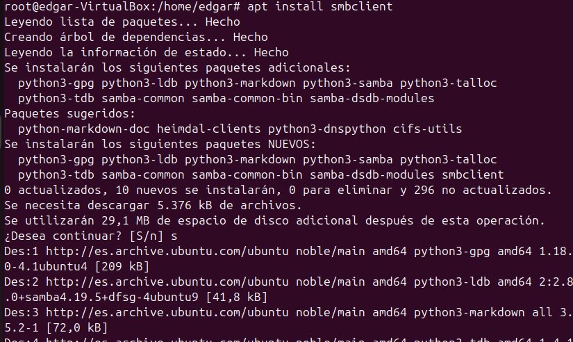
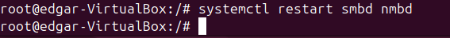
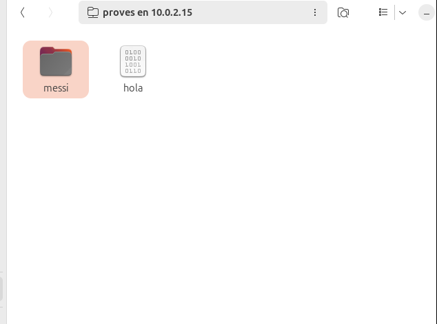
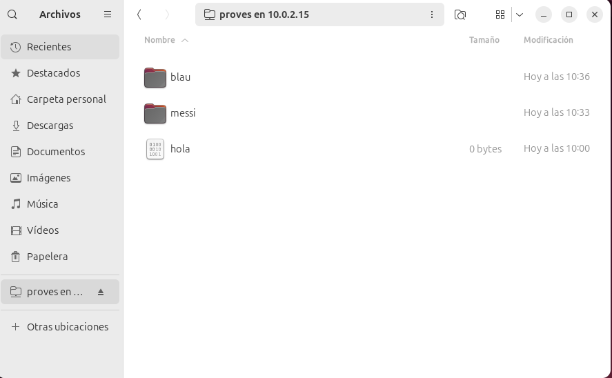
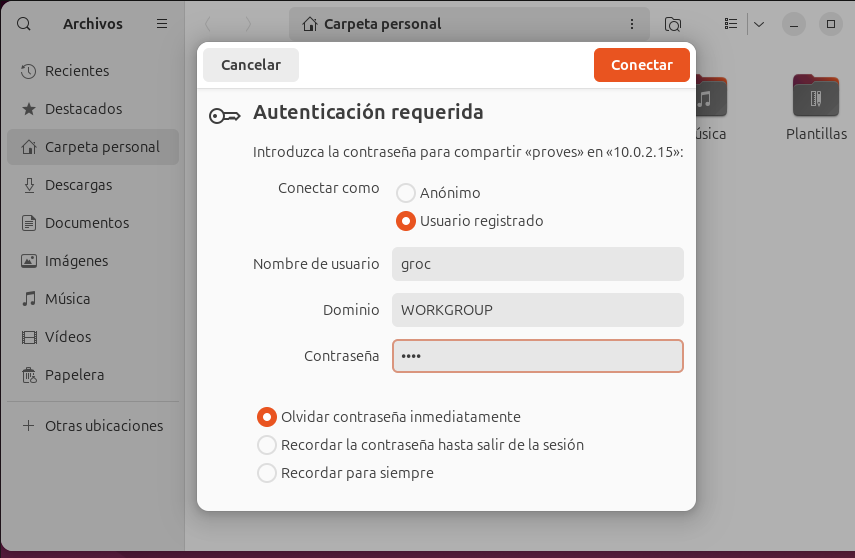
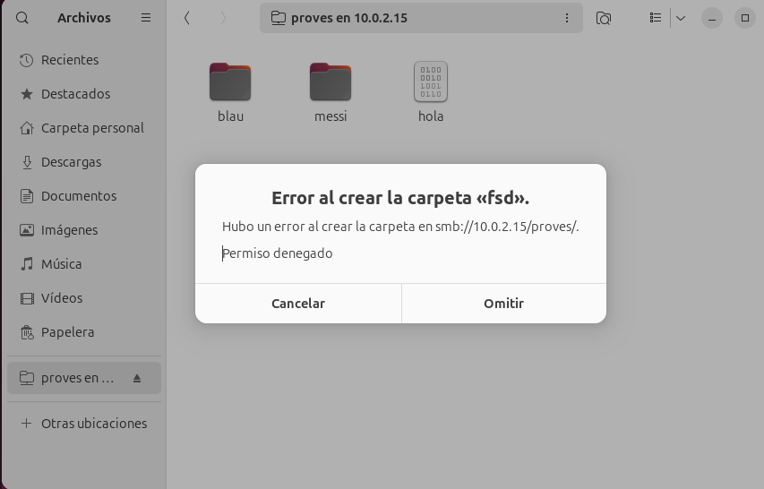

**Servidor Samba**

Samba és una implementació lliure del protocol SMB/CIFS, que permet compartir arxius i impressores entre sistemes Windows i Linux. Samba pot autenticar usuaris localment o mitjançant un servidor LDAP. Això permet gestionar usuaris i permisos de manera centralitzada.

*Instal·lació i conf server*

En primer lloc com hem vist altres vegades farem un update del nostre servidor i després procedirem instal·lant el paquet smb.

apt install samba

Un cop tenim el paquet instal·lat procedirem a crear una carpeta a l'arrel i assignar-li els permisos adients.

Per continuar, entrarem al fitxer de configuració de samba /etc/samba/smb.conf aquí definirem la ruta de la carpeta que volem compartir i adicionalment podrem assignar rols i permisos als usuaris i grups, en aquest cas farem uns usaris del grup colors per veure un amb tots el permisos, un amb sol permis de lectura i un sense permisos.

Després de cada cop que fem una modificació al fitxer de configuració per apliacr aquestos canvis haurem de fer un reeinici del sistema, amb la comanda systemctl restart smbd nmbd.

A continuació, crearem els usuaris, aquest cop ho farem amb una comanda per a que aquest no iniciin sessió, i el seu interpret de comandes sigui el /bin/bash.

Amb el matiex metode que creem el primer usuari crearem els altres i el grup. Com es pot apreciar l'usuari blau no està al grup.

Per comprovar que els usuaris i el grup han estat creats correctament farem un tail dels fitxers /etc/group i /etc/passwd

Per últim canviarem algúns permisos com ara que l'usuari roig no pugui entrar, que els usuaris del grup colors puguin llegir i que balu pot llegir i escriure. També podrem iniciar sessió com a convidat.

**Instal·lació i proves client**

Per configurar la part del client, repetirem els passos anteriors, fer un update i després instal·lar el paquet de samba.

Un cop hem instal·lat el paquet obrim l'explorador d'arxius i ha altres ubicacions posarem l'adreça del nostre server i amb que ens connectem (samba).

Un cop ens connectem la primera pantalla que ens apareix es per entrar com a convidat o com usuari registrat. Primer farem les proves amb un usuari convidat.

IMPORTANT (aquesta part es al server) .Ara per assegurar-nos eliminem l'opció de read only ja que també volem escriure amb els usuaris. Un cop fet els canvis hem de reiniciar el sistema.

Quan acabem amb al servidor, tornem al client i fem les proves corresponents amb els usuaris. Per això ens connectarem a la carpeta compartida a través de l'explorador d'arxius i a la part d'altres ubiacacions possarem l'adreça del nostre servidor samba. I la primera opció serà entrar com convidat / anonim. Per comprovar que podem crear un directori.

Després, provarem amb el primer usuari i el que te mes permisos que és blau. Amb el mateix metode que abans posarem les credencials de blau i crearem un directori nou.

Per veure si els directoris que hem creat tenen els permisos corresponents als seus usuaris anem al SERVER i allà dins de la carpeta que compartim amb samba i fem un ls -l.

Com funciona adequadament procedim amb els usuaris que queden, tornem al client i entrem com roig, i com aquest no pot entrar ens retorna a la pantalla de "login".

Finalment entrarem amb l'usuari groc i farem un directori, com no te permisos d'escriptura ens donarà un error.

