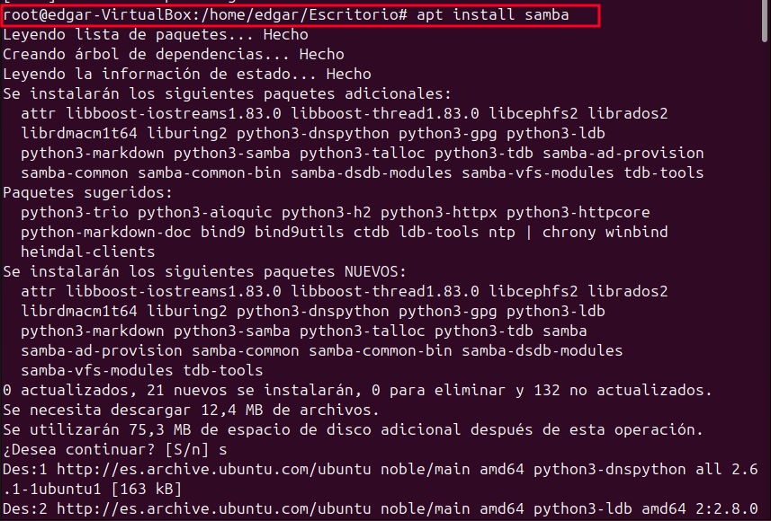
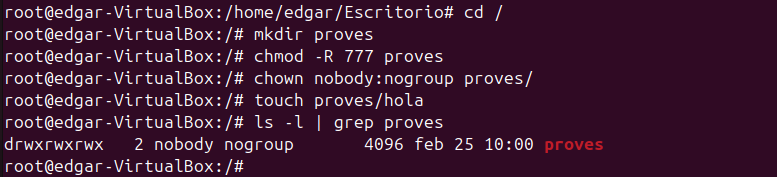
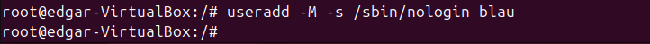
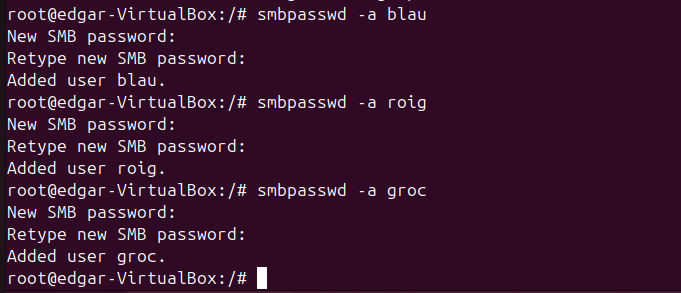
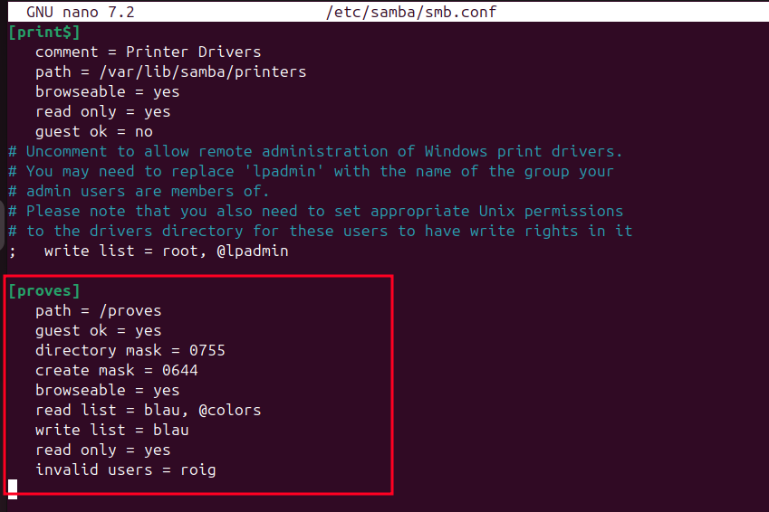
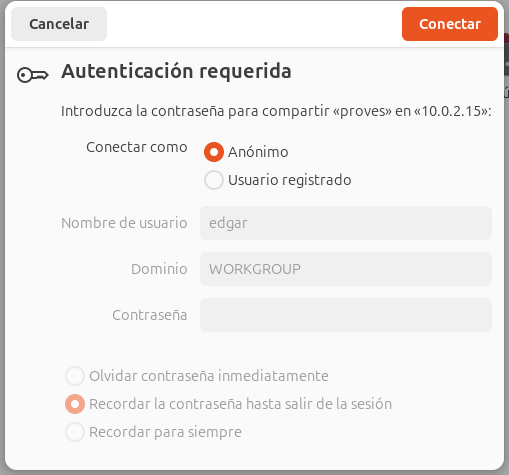
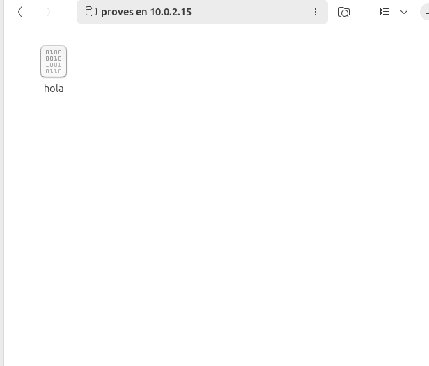
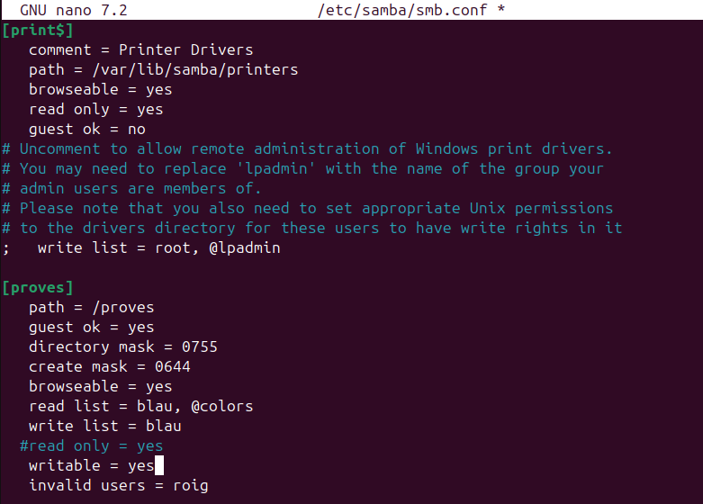
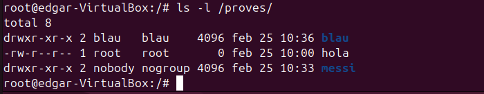
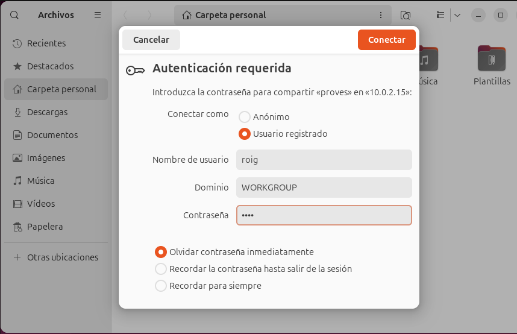

**Servidor Samba**

Samba és una implementació de codi obert del protocol SMB/CIFS, que facilita la compartició de fitxers i impressores entre sistemes Windows i Linux. A més, Samba permet l'autenticació d'usuaris tant localment com mitjançant un servidor LDAP, cosa que facilita una gestió centralitzada d'usuaris i permisos.

*Instal·lació i conf server*

Primer de tot, actualitzem el sistema i després instal·lem el paquet de Samba:
apt install samba

Un cop instal·lat, creem una carpeta a l'arrel del sistema i li assignem els permisos adequats.

A continuació, editem el fitxer de configuració de Samba situat a /etc/samba/smb.conf. En aquest arxiu, especifiquem la ruta de la carpeta que volem compartir i configurem els permisos i rols per als usuaris i grups. En aquest cas, afegirem usuaris al grup colors amb diferents nivells de permisos: un amb accés complet, un amb només lectura i un sense cap permís.

Cada vegada que modifiquem la configuració, cal reiniciar el servei per aplicar els canvis amb la comanda següent:

Ara crearem els usuaris. Utilitzarem una comanda que impedeix que iniciïn sessió i que estableix /bin/bash com a intèrpret d'ordres.

Seguirem el mateix procediment per crear els altres usuaris i el grup. En aquest exemple, podem veure que l'usuari blau no està dins del grup.

Per verificar que s'han creat correctament els usuaris i grups, consultarem els fitxers /etc/group i /etc/passwd.

Finalment, ajustarem els permisos: bloquejarem l'accés a l'usuari roig, permetrem només lectura als membres del grup colors, i donarem a blau permisos complets. També habilitarem l'accés com a convidat.

**Instal·lació i proves client**

Per configurar el client, seguim un procés similar: actualitzem el sistema i instal·lem el paquet de Samba.

Un cop instal·lat, obrim l'explorador de fitxers i, a la secció d'Altres ubicacions, introduïm l'adreça del servidor Samba.

El primer que veurem és l'opció de connectar-nos com a convidat o com a usuari registrat. Farem primer una prova amb un usuari convidat.

(ATENCIÓ: Aquesta part es fa al servidor)
Per assegurar-nos que podem escriure, eliminem l'opció de read only. Després de fer els canvis, reiniciem el servei.

Un cop configurat el servidor, tornem al client i provem els accessos. Ens connectem a la carpeta compartida mitjançant l'explorador de fitxers i l'opció d'Altres ubicacions, i primer accedim com a convidat per comprovar si podem crear un directori.

A continuació, farem la mateixa prova amb l'usuari blau, que té permisos complets. Introduïm les credencials i creem un nou directori.

Per confirmar que els permisos són correctes, al servidor executem ls -l dins de la carpeta compartida.

Un cop verificat el funcionament, provem amb la resta d'usuaris. Si intentem accedir amb roig, que no té permisos, el sistema ens retornarà a la pantalla d'inici de sessió.

Finalment, provem amb l'usuari groc i intentem crear un directori. Com que no té permisos d'escriptura, es generarà un error.

