**Servidors NFS**
El Network File System (NFS) és un protocol que permet compartir fitxers i directoris a través d’una xarxa, facilitant l’accés centralitzat als recursos. Amb NFS, un servidor pot exportar directoris, i els clients poden muntar-los com si fossin locals, cosa que el fa ideal per a entorns col·laboratius o sistemes distribuïts on diversos dispositius necessiten accedir als mateixos fitxers.

Una característica clau d’aquest protocol és que l'autenticació es realitza a nivell de màquina, no d’usuari. Això significa que el servidor NFS confia en els dispositius clients autoritzats per accedir als directoris compartits. A més, combinant NFS amb LDAP, és possible centralitzar els directoris personals dels usuaris i muntar-los automàticament en qualsevol dispositiu de la xarxa, proporcionant una experiència homogènia independentment de l’equip utilitzat.

**Instal·lació part server**

Comencem configurant la part del servidor en un sistema Linux. Instal·larem el paquet necessari:

apt install nfs-kernel-server

Un cop instal·lat, verifiquem que el servei s’ha iniciat correctament:

systemctl status nfs-server

Si el servei està en funcionament sense errors, el servidor NFS ja està llest per a ser configurat.

**Instal·lació part client Ubuntu**

Ara configurarem un client NFS en una màquina Ubuntu. Instal·lem els paquets necessaris per connectar-nos al servidor:

apt install nfs-common rpcbind

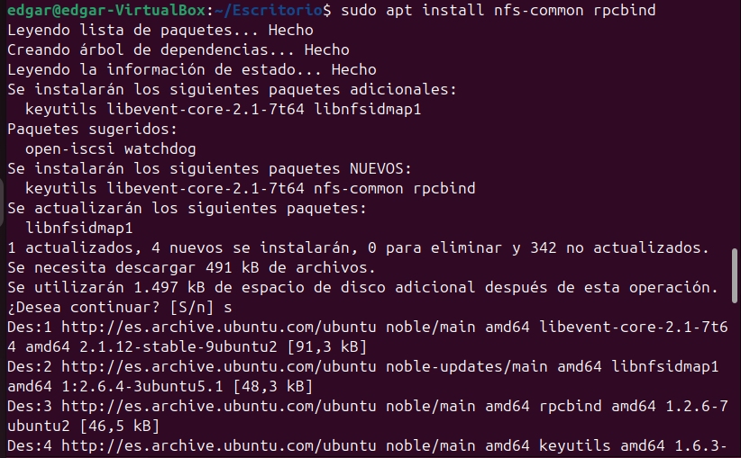

Amb això, el sistema estarà preparat per muntar directoris compartits mitjançant NFS.

**Instal·lació part client Windows**
Per connectar un equip Windows a un servidor NFS, cal activar una funcionalitat específica dins del sistema operatiu.

Procedim seguint aquests passos:

Obrim el Panell de Control.
Accedim a Programes i Característiques.
A l'esquerra, fem clic a Activar o desactivar les característiques de Windows.
Activem les opcions relacionades amb NFS.

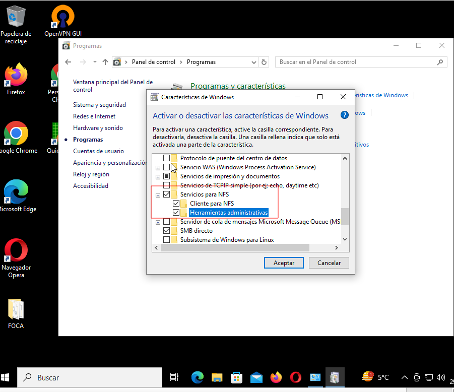
Un cop fet això, Windows ja estarà preparat per muntar unitats NFS i accedir als recursos compartits.

**Utilitzar el servidor NFS**

Per començar a utilitzar el servidor NFS, primer creem un directori al servidor i li assignem els permisos adequats.

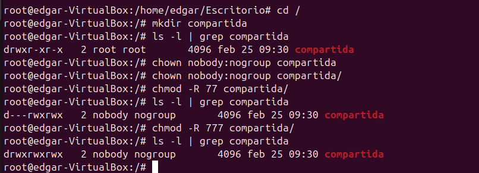

A continuació, editem el fitxer /etc/exports per afegir la ruta de la carpeta compartida i els paràmetres següents:

* → Permet l'accés a tots els clients.
rw → Concedeix permisos de lectura i escriptura (read-write).
sync → Garanteix que les operacions d’escriptura es completen abans de respondre al client.
no_subtree_check → Millora el rendiment evitant la verificació de subdirectoris.

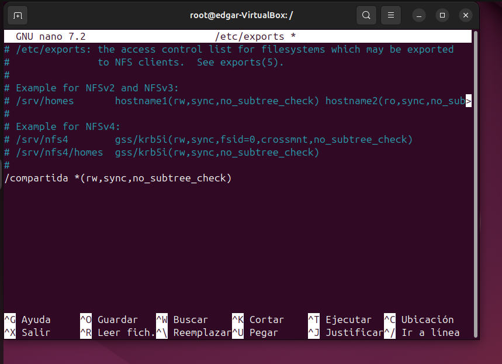

Després de realitzar aquests canvis, reiniciem el servei per aplicar-los. A més, creem un fitxer de prova dins la carpeta compartida per verificar-ne el funcionament.

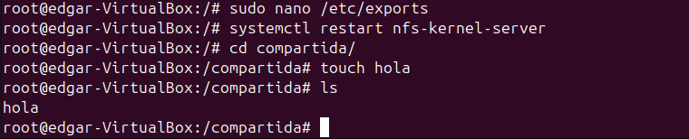

Ara provem l'accés des d’un client Windows. Obrim l'explorador de fitxers, anem a Altres ubicacions i introduïm l’adreça del servidor per connectar-nos.

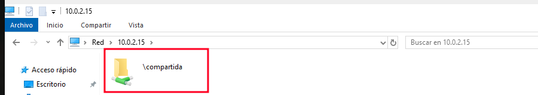

Per comprovar que tot funciona correctament, testejarem els permisos creant un document de text dins la carpeta compartida.

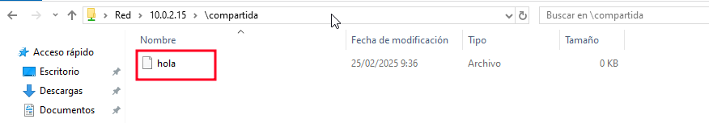
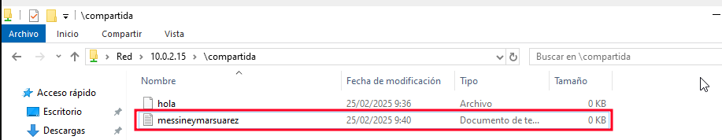

A continuació, comprovem des del servidor que els canvis s'han aplicat correctament i verifiquem els permisos assignats.

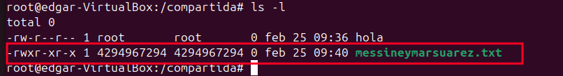

Ara accedim des d’un client Ubuntu. Primer, creem la carpeta compartida amb els permisos corresponents.

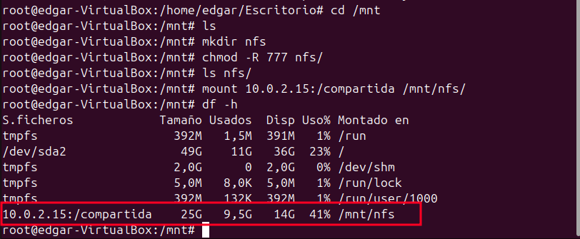

Finalment, verifiquem els permisos i comprovem que els fitxers es mantenen a la carpeta compartida de manera íntegra. A més, creem un nou fitxer des del client per confirmar que el sistema funciona com cal.

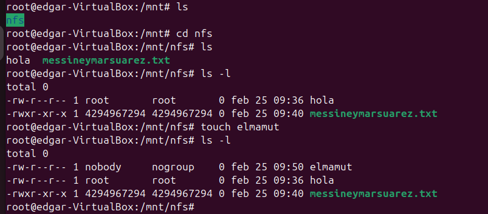

