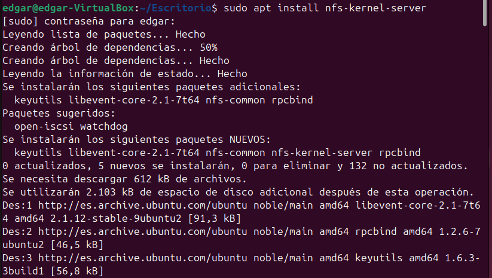

**Servidors NFS**
El Network File System (NFS) és un protocol que permet compartir fitxers i directoris a través d’una xarxa, facilitant així l’accés a recursos de manera centralitzada. Gràcies a NFS, un servidor pot exportar directoris, i els clients poden muntar-los com si fossin propis, sense notar diferència entre un fitxer local i un de la xarxa. Aquesta funcionalitat resulta especialment útil en entorns col·laboratius o en sistemes distribuïts on diversos equips necessiten accedir als mateixos fitxers.

Una de les característiques principals d’aquest protocol és que l'autenticació es fa a nivell de màquina i no d’usuari. Això implica que el servidor NFS confia en els dispositius clients als quals ha concedit permís per accedir als directoris compartits. Gràcies a la combinació de NFS i LDAP, és possible centralitzar els directoris personals dels usuaris i muntar-los automàticament en qualsevol dispositiu de la xarxa, garantint així una experiència d’usuari homogènia independentment de l’equip utilitzat.

**Instal·lació part server**
Comencem configurant la part del servidor NFS en un sistema Linux. Per fer-ho, instal·larem el paquet necessari per al servidor NFS:

apt install nfs-kernel-server

Un cop finalitzada la instal·lació, cal verificar que el servei s'ha activat correctament:

systemctl status nfs-server

Si el servei està en execució sense errors, ja tenim el servidor NFS instal·lat i a punt per configurar-lo.

**Instal·lació part client Ubuntu**
Ara configurarem un client NFS en una màquina Ubuntu. Els passos són similars: primer, instal·lem els paquets necessaris per poder connectar-nos a un servidor NFS:

apt install nfs-common rpcbind

Amb això, el sistema ja està preparat per muntar directoris compartits mitjançant NFS.

**Instal·lació part client Windows**
Si volem connectar un equip Windows a un servidor NFS, hem d'activar una funcionalitat específica dins del sistema operatiu.

Per fer-ho, seguirem aquests passos:

Obrim el Panell de Control.
Accedim a Programes i Característiques.
A l'esquerra, fem clic a Activar o desactivar les característiques de Windows.
Busquem i activem les opcions relacionades amb NFS.

Un cop activades les funcionalitats corresponents, el sistema Windows ja estarà preparat per muntar unitats NFS i accedir als recursos compartits del servidor.

*Utilitzar el servidor NFS*

Per començar a utilitzar el servidor NFS el primer que farem serà crear un directori a la nostra màquina servidor i li canviarem els permisos.

Per poder compartir la carpeta que hem fet modificarem l'arxiu /etc/exports i aquí posarem la ruta de la nostra carpeta i els següents parametres. *: Permet l'acces a tots els clients. rw: Permet lectura i escriptura (read-write). sync: Assegura que les operacions d'escriptura es completen abans de respondre al client. no_subtree_check: Millora el rendiment en no comprovar els subdirectoris.

Un cop feta aquesta modificació haurem de reiniciar el sevei per a que els canvi s'apliquin. Després crearem un arxiu per fer proves a la carpeta compartida desde la nostra màquina servidor.

Ara que ja tenim la carpeta preparada entrarem desde el nostre client Windows, a l'explorador d'arxius si anem a altres ubiacacions i allà posem l'adreça del nostre servidor podrem connectar-nos.

Ara ja que tenim tot correctament configurat, el que farem serà comprovar que ens ha funcionat de manera correcta, comprovarem que els permsios son funcionals, i crearem un document de text per a fer-ho.

Seguidament, també veurem que al servidor s'hagui aplicat, i els permisos amb els que ho ha fet.

A continuació, entrarem a la nostra maquina client Ubuntu i el que farem serà crear la carpeta compartida amb els permsios corresponents.

Seguidament el que farem sera comprovar els permisos i veure que esta tot a la carpeta compartida de manera integra. A més crearem un nou fitxer des d'aqui.

