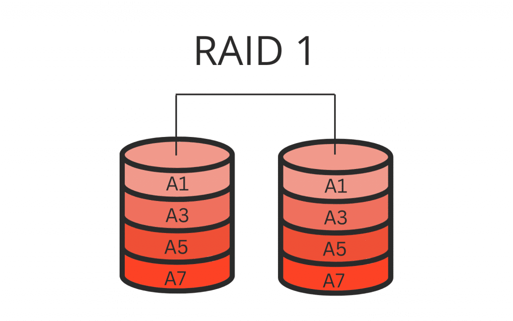

**Documentació RAID**

*Introducció als RAID*

Els RAID (Redundant Array of Independent Disks) són tècniques que combinen diversos discs físics per crear un sistema d'emmagatzematge unificat, millorant el rendiment i/o la seguretat de les dades segons el nivell utilitzat.

Avui en dia també existeixen solucions que, tot i no ser RAID en el sentit tradicional, ofereixen funcions similars de redundància i tolerància a fallades. Un exemple d'això és CEPH, un sistema d'emmagatzematge distribuït que proporciona redundància avançada, auto balanceig i alta escalabilitat.

*Nivells RAID més comuns*

Nivells RAID
RAID 0: Avui en dia es considera obsolet. Consisteix en dividir les dades i distribuir-les entre discs sense redundancia. El nivell de seguretat es pràcticament nul, ja que pots perdre les dades fàcilment.

RAID 1: Funciona amb el metode "espill" que consisteix en fer una copia exacta de les dades en un altre disc, això ens dona redundancia (es com un copia de seguretat en temps real).

RAID 5: Utilitza com a minim tres discs, tot i que també es pot fer amb quatre. El sistema d'emmagatzematge reparteix l'informació entre tots els discs menys a un que es l'utilitzat per la paritat, en cas de fallar un disc pots recuperar l'informació.

RAID 6: El funcionament es exactament igual que l'anterior, la diferencia principal es que la paritat es guarda en dos

RAID 10	Combina duplicació (RAID 1) i distribució (RAID 0) es de molt alt rendiment i en el tema seguretat te un cost elevat per la necessitat de més discs

ZFS: Sistema d'arxius amb funcions RAID

ZFS és un sistema d'arxius combinat amb gestor de volums desenvolupat per Sun Microsystems (ara Oracle). Entre les seves característiques destaca:

Integritat de dades: Utilitza sumes de verificació i té capacitat d'auto reparació.

Snapshots i clonació: Permet fer còpies de seguretat i recuperar dades fàcilment.

Compresió i deduplicació: Optimitza l'ús de l'espai.
Pooled storage: Facilita una gestió flexible dels discos.
ZFS integra els seus esquemes de redundància, coneguts com a RAID-Z, que són funcionalment equivalents als RAID tradicionals però amb millores en rendiment, fiabilitat i simplicitat de gestió.

Solució d'emmagatzematge distribuït: CEPH
CEPH és un sistema d'emmagatzematge distribuït que va més enllà del concepte tradicional de RAID. Les seves principals característiques són:

Redundància avançada: Utilitza replicació i erasure coding per garantir la disponibilitat de les dades.

Auto balanceig: Redistribueix automàticament la càrrega entre nodes per optimitzar el rendiment.

Escalabilitat: Permet ampliar la capacitat d'emmagatzematge afegint més nodes sense parades.

Tot i que CEPH opera a un nivell diferent (distribuït i basat en programari), comparteix amb els RAID l'objectiu de protegir i optimitzar l'emmagatzematge de dades.

Aspectes clau en la configuració de RAID
Uniformitat dels discs i particions:

Es recomana utilitzar discs o particions de la mateixa marca i capacitat per obtenir una configuració òptima.

Planificació de la configuració:
Cal preparar correctament els discs, configurar el nivell RAID desitjat i, finalment, automatitzar el muntatge per facilitar l'accés a les dades.