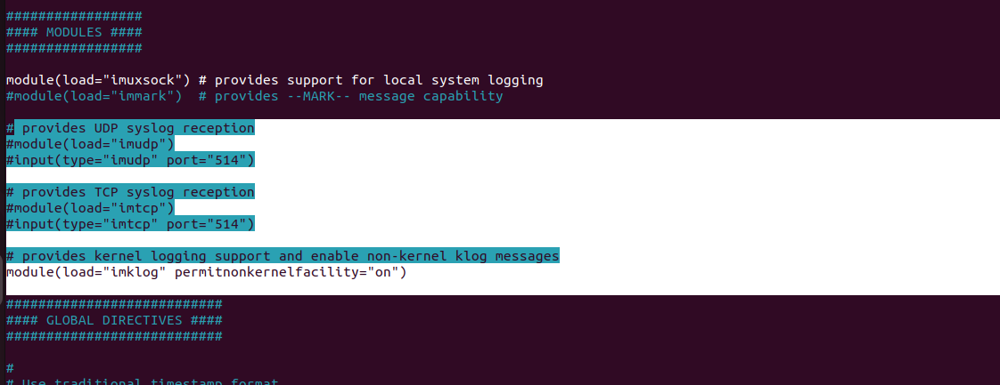
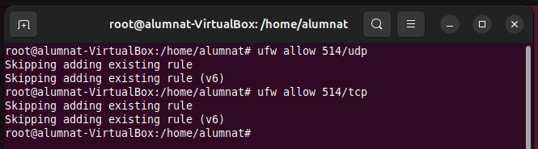

Monitorització
LOGS
Els logs són fitxers de registre que documenten tot allò que succeeix en el sistema operatiu. Recullen informació tant dels processos del sistema com de les aplicacions, i són essencials per a tasques de diagnòstic i anàlisi. La majoria es troben ubicats al directori /var/log.

Per evitar que aquests registres creixin indefinidament, és important definir una rotació de logs. Això es pot gestionar editant el fitxer /etc/logrotate.conf, on podem establir, per exemple, que es rotin setmanalment. També podem personalitzar la rotació per a determinats logs mitjançant fitxers ubicats a /etc/logrotate.d.

Com a exemple, veurem com esta configurarada la rotació dels logs de dpkg, especificant que es rotin mensualment, es conservin els últims 12 fitxers antics, es comprimeixin després de cada rotació i se'ls apliquin permisos concrets.

Els fitxers de configuració com /etc/rsyslog.d/50-default.conf ens permeten definir quins tipus de missatges es registren i on es guarden. Qualsevol canvi en aquest fitxer requereix un reinici del servei rsyslog.

Per verificar-ne el funcionament, podem enviar una alerta al sistema de correu i comprovar si s'ha registrat correctament al fitxer corresponent. També podem fer que totes les alertes de nivell crític es desin en un directori específic, la qual cosa facilita l’anàlisi de situacions greus.

**Systemd Journal**

El journal de systemd centralitza els registres dels diferents serveis i components del sistema. A diferència de comandes com cat, que només mostren un fitxer concret, journalctl ofereix una visió unificada.

Amb l’ordre journalctl -p crit, podem filtrar i mostrar només els missatges de nivell crític. Això ens permet detectar errors com problemes amb RAID, intents fallits d’autenticació o alertes com la que hem generat.

LOGS en Xarxa
Configuració del Receptor
El primer pas per monitoritzar registres de manera remota és configurar el dispositiu receptor. Per fer-ho:

Instal·lem el paquet rsyslog amb la següent comanda:

sudo apt install rsyslog

Editem el fitxer /etc/rsyslog.conf descomentant els mòduls i entrades necessàries per permetre la recepció de logs per xarxa.

Reiniciem el servei rsyslog i obrim els ports corresponents al tallafocs.

Configuració de l’Emissor
A continuació, configurem el dispositiu emissor, que enviarà els logs:

També hi instal·lem rsyslog.

Modifiquem /etc/rsyslog.conf per indicar la IP del receptor.

Finalitzada la configuració, al receptor podem executar tail -f /var/log/syslog per veure els registres rebuts.

Des de l’emissor, provoquem un error d’autenticació per generar un registre i comprovem que aparegui correctament al receptor, mostrant la IP origen.

REMOT
1. Configuració de la màquina receptora (la que rep els logs)
El primer pas és anar a la màquina virtual que rebrà els logs remots i instal·lar el servei rsyslog:

2. Obrir els ports al firewall
Per assegurar que la comunicació sigui possible, obrim el port 514 per UDP i TCP:

sudo ufw allow 514/udp  
sudo ufw allow 514/tcp

Ara anirem a la màquina que envia el log, en aquesta també instal·larem rsyslog i en la configuració afegirem la ip del receptor.

sudo apt update

sudo apt install rsyslog

3. Configuració de la màquina emissora (la que envia els logs)
Ara anem a la màquina que enviarà els logs. Igualment, instal·lem rsyslog:

Un cop tot estigui configurat, enviem alguns logs de prova des de la màquina emissora per verificar que arriben correctament.

Confirmació de recepció
Finalment, si la configuració ha estat correcta, veurem els missatges enviats des de la màquina emissora apareixent al fitxer de log de la màquina receptora.

