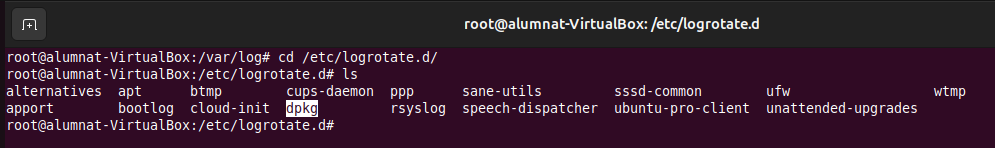
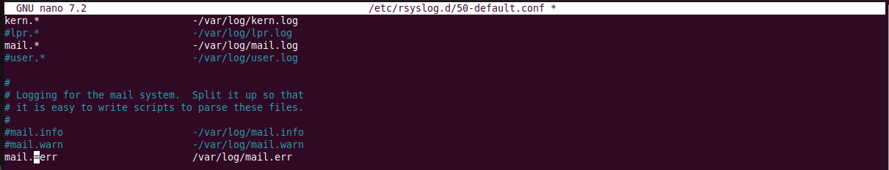
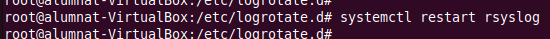
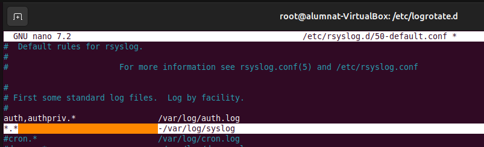
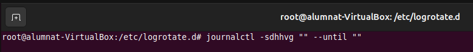
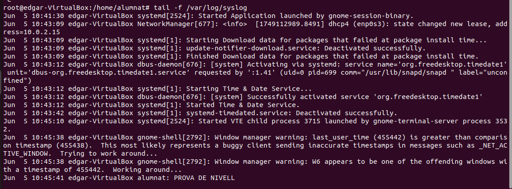

Monitorització i rendiment
INTERFÍCIE GRÀFICA
Una de les eines que podem fer servier per tindre controlat el rendiment, és el programa Estadístiques de l'energia. Aquesta serveix per tindre informació sobre el dispositiu, tipus, si és xarxa elèctrica i cada quan es refresca, entre altres caracteristiques. 

Seguidament, també tenim el programa Monitor de sistema, aquest té diferents apartats, per exemple en aquest que mostro a la captura podem observar tots els processos actius, quan consumeixen, usuari que el provoca, etc. 

En el segon apartat podem veure en més detall el consum a temps real de la cpu, la xarxa i el disc. 

Per últim, tenim l'apartat File System, aquest mostra quant estem utilitzant al disc. 

TERMINAL
El primer que farem és observar el fitxers que conté el directori /var/log/. Seguidament explicaré la funció de cadascun:

cd /var/log/

alternatives.log: Registra els canvis en el sistema d'alternatives d'Ubuntu, que gestiona enllaços simbòlics per diferents versions de programes.
apport.log: Guarda informació sobre fallades i errors en aplicacions, útil per depurar problemes.
apt/: Directori que conté els registres de les operacions de apt, com instal·lacions, actualitzacions i eliminacions de paquets.
auth.log: Guarda informació sobre autenticacions del sistema, inici de sessió d'usuaris i esdeveniments relacionats amb la seguretat.
boot.log: Conté els missatges generats durant l'inici del sistema.
bootstrap.log: Registra informació sobre la instal·lació inicial del sistema operatiu.
btmp: Registra intents de connexió fallits. Es pot llegir amb lastb.
cloud-init.log / cloud-init-output.log: Fitxers relacionats amb la configuració inicial en sistemes basats en el núvol (Cloud-init).
cups/: Directori amb registres del servei d'impressió CUPS.
cups-browsed: Fitxer de registre del servei de detecció d'impressores en la xarxa.
dist-upgrade: Conté informació sobre actualitzacions de distribució (do-release-upgrade).
dmesg: Registra missatges del nucli (kernel), útil per veure errors de hardware i dispositius durant l'arrencada.
dpkg.log: Registra totes les accions realitzades pel gestor de paquets dpkg (instal·lacions, eliminacions, actualitzacions).
faillog: Conté informació sobre intents de connexió fallits dels usuaris.
fontconfig.log: Relacionat amb la configuració i registre de fonts tipogràfiques en el sistema.
gdm3: Registre del gestor de sessió gràfica GDM3 (GNOME Display Manager).
gpu-manager.log: Conté informació sobre la gestió de la GPU en el sistema.
hp/: Directori amb registres de HPLIP, el programari per a impressores HP.
installer/: Registres relacionats amb la instal·lació inicial del sistema operatiu.
journal/: Conté els registres del systemd-journald, una alternativa a syslog per registrar esdeveniments del sistema.
kern.log: Guarda informació sobre el nucli de Linux, útil per detectar errors de maquinari o * mòduls del nucli.
lastlog: Conté informació sobre la darrera connexió de cada usuari. Es pot consultar amb lastlog.
openvpn/: Directori amb registres del servei OpenVPN, si està instal·lat.
private/: Carpeta que pot contenir registres sensibles i restringits.
README: Normalment, un fitxer de text amb informació sobre el contingut del directori /var/log/.
speech-dispatcher: Registres del servei speech-dispatcher, utilitzat per a la síntesi de veu en aplicacions d'accessibilitat.
sssd: Conté registres del System Security Services Daemon, que gestiona autenticacions i serveis relacionats amb usuaris.
syslog: Registre principal del sistema que conté missatges de diferents serveis i aplicacions.
sysstat: Registres de l'eina sysstat, que monitoritza el rendiment del sistema.
ubuntu-advantage.log: Registre relacionat amb Ubuntu Advantage, un servei empresarial d'Ubuntu.
unattended-upgrades: Conté registres de les actualitzacions automàtiques del sistema (unattended-upgrades).
wtmp: Manté un registre de les connexions dels usuaris. Es pot consultar amb last.

Seguidament entrarem dins del fitxer /etc/logrotate.conf aquest serveix per configurar la gestió automàtica dels fitxers de registre del sistema, definint cada quant temps es roten, es comprimeixen, s'eliminen o es conserven els registres antics per evitar que ocupin massa espai al disc.

sudo nano /etc/logrotate.conf

Després també tenim el directori /etc/logrotate.d/, aquest conté configuracions específiques de logrotate per a diferents serveis i aplicacions del sistema. Cada fitxer dins d'aquest directori defineix les regles de rotació de logs per un servei concret, permetent una gestió més detallada i personalitzada dels registres.

cd /etc/logrotate.d/

sudo nano dpkg

En versions anteriors el fitxer /etc/rsyslog.conf era el que administrava tot, ara si entrem dins el propi fitxer indica que la ruta correcta és /etc/rsyslog.d/*.conf.

sudo nano /etc/rsyslog.conf

Entrarem dins del fitxer /etc/rsyslog.d/50-default.conf, aquest és el administra actualment.

sudo nano /etc/rsyslog.d/50-default.conf

Farem un tail -f /var/log/syslog per revisar els logs a temps real.

tail -f /var/log/syslog

Seguidament, farem un parell de proves. Per exemple si amb el logger creem un log d'alter en mail amb un missatge al executar-ho apareixerà al tail.

tail -f /var/log/syslog

logger -i -s -p mail.alert Alerta de mail!!!

Si revisem el contingut dels fitxers mail.log i mail.err ens sortirà el resultat.

cat /var/log/mail.log

cat /var/log/mail.err

Tot seguit, realitzarem un parell de canvis. En el fitxer de configuració canviarem la linia de mail.err i li ficarem un "=".

mail.=err /var/log/mail.err

Cada vegada que modifiquem aquest fitxer haurem de reinciar el servei, ja que si no els canvis no s'aplicaran.

systemctl restart rsyslog

Després, farem un tail en el que quan creesem una alerta de mail ens sortirà al propi tail i als fitxers mail.log i mail.err.

tail -f /var/log/syslog

logger -i -s -p mail.alert Alerta de error mail

cat /var/log/mail.log

cat /var/log/mail.err

Seguidament, anirem al fitxer de configuració i que tots els fitxers crit vaigin al fitxer alumnat.log, aquest el creem per què alhora de revisar errors critics en el sistema diariament, ens ajuda a trovar-los més rapidament.

*.crit /var/log/alumnat.log

systemctl restart rsyslog

A continuació per que surten tots els errors a syslog ficarem asteriscs.

*.* -/var/log/syslog

Com podem obeservar amb el tail veurem que els fitxers .crit surten.

A continuació per filtrar procesos podem utilitzar grep o també podem utilitzar journalctl.

cat /var/log/syslog | grep alumnat

journalctl -p crit

També podem filtrar a partir de serveis o a partir de noms.

journalctl -u auth

journalctl -sdhhvg "" --until ""

REMOT
El primer que haurem de fer és anar a la vm que rep el log remot i instal·lar rsyslog. Després anirem al fitxer /etc/rsyslog.conf i descomentarem les linies que indica la captura.

sudo apt update

sudo apt install rsyslog

Seguidament al firewall acceptarem del port 514 udp i tcp. En acabar, haurem de fer un sudo systemctl restart rsyslog.

ufw allow 514/upd

ufw allow 514/tcp

Ara anirem a la màquina que envia el log, en aquesta també instal·larem rsyslog i en la configuració afegirem la ip del receptor.

sudo apt update

sudo apt install rsyslog

A continuació desde la vm receptora farem un tail de syslog per escoltar.

tail -f /var/log/syslog

Després desde l'emissor, enviarem els següents logs. log

Per últim podrem observar desde la receptora que ha funcionat correctament el procès.

