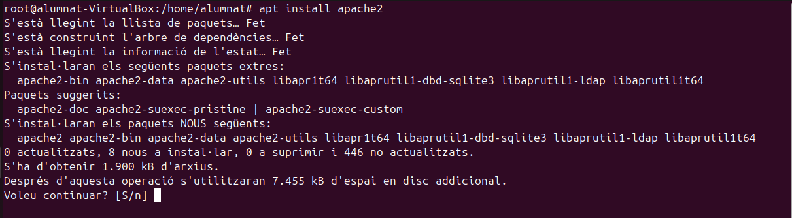
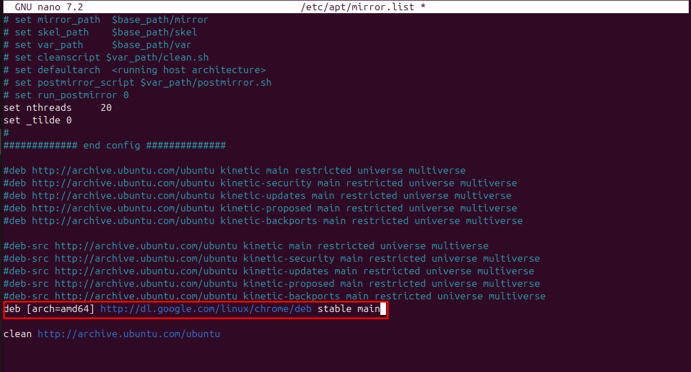

Servidor actualitzacions
Un servidor d'actualitzacions es un servidor al qual diversos equips clients estàn connectats i agafen els paquets d'actualitzacions d'aquesta màquina servidor, així no col·lapsem els serveis si molts clients es volen descarregar un paquet a la vegada. Per comprovar el funcionament d'aquesta metodologia utlitzarem l'eina apache.

- Servidor
En primer lloc, instal·larem el paquet apache. 

Segudiament, instal·larem el paquet mirror, que serà el que ens permetrà copiar qualsevol cosa que tinguem en un directori a un altre, com si fos un mirall. 

A continuació, al fitxer /etc/apt/mirror.list configurarem el paquet d'instal·lació de google chrome. 

Un cop tenim aquest fitxer modificat executarem l'apt-mirror 

Després, ens assegurarem que a la carpeta del mirror hi hagi el paquet d'instal·lació del chrome de la següent manera: 

Si hem seguit tots aquests passos la part de configurar el servidor ja ha finalitzat, ara procedirem a la configuració del client per poder accedir al instal·lador del chrome del client al servidor.

- Client
El primer pas és afegir la clau GPG de Google al sistema. Aquesta clau s'utilitza per verificar la integritat i autenticitat dels paquets descarregats des dels repositoris de Google, en aquest cas Chrome.

A més a més, al fitxer ubuntu.sources afegirem la ruta del paquet del chrome, però, amb la IP del nostre servidor. 

Seguidament, modificarem l'arxiu /etc/apt/sources.list.d/ubuntu.sources que aquí també li indicarem que els paquets que volem que instal·li tinguin la ruta del nostre servidor, així ens assegurem de que els extreu del servidor. 

Finalment, llançarem un update al client per veure si realment utilitza les rutes que apunten al servidor, i ens fixarem si els paquets contenen la IP d'aquest. 

Per acabar, veurem que si que agafa els paquets del servidor, sol ens quedaria verificar que s'ha instal·lat el chrome correctament. 

