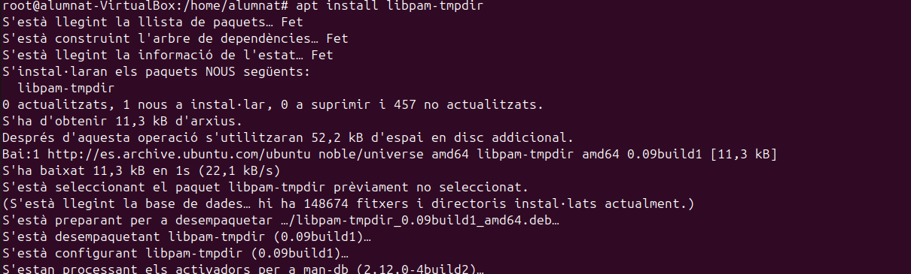
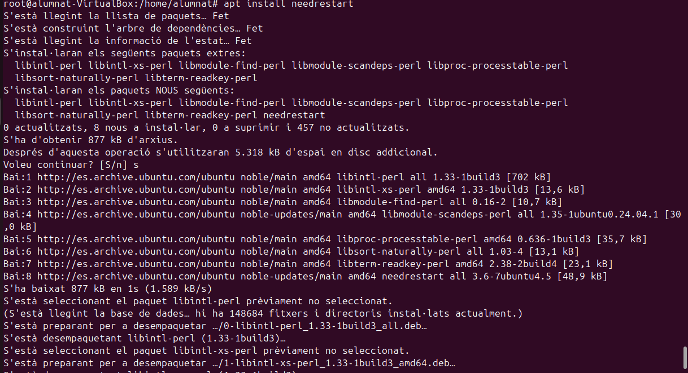

Auditoria
- Lynis
El primer pas que hem dur a terme es fer un update, un cop acabat instal·larem el Lynis

sudo apt install lynis -y

Un cop tenim el paquet instal·lat executarem el programa per fer un escaneig al sistema.

lynis audit system

Un cop executada aquesta comanda el programa començarà un escaneig de tot el sistema i els seus apartats, per cada part ens detallarà l'estat si esta correcte, no trobat, o amb algun error. I per últim ens mostrarà un resum amb els detalls del que ha escanejat. ç

En cas de voler fer un escaneig ràpid podem utilitzar la següent comanda. El resultat es similar a l'anterior.

lynis -Q

Als dos escaneigos que hem realitzat ens trobarem que hi ha un apartat de sugerencies per millorar la seguretat del nostre dispositiu, i com podrem veure al resum detallat, ens diu el nivell de "hardening index" que vindria a ser un índex de nivell de seguretat.

 

Per millorar aquest index, podem començar instal·lant i seguint els passos de les propostes, l'únic porblema es que el paquet listbugs ha quedat obsolet i ara es diu listchanges. A continuació mostraré com instal·lo diversos paquets i el resultat de la millora del índex.

