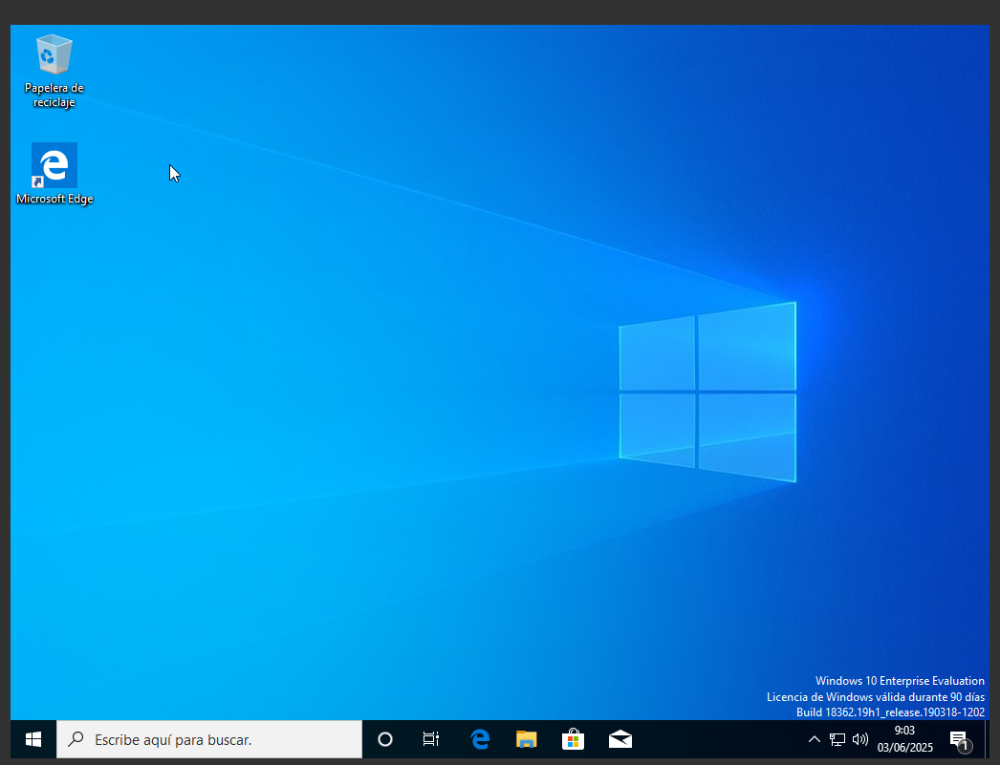

Introducció
En aquest projecte veurem la funcionalitat del sistema operatiu Windows, el seu tipus de llicències i també identificarem els seus elements funcionals. Realitzarem la seva instal·lació i configuració, i mostrarem com configurar els serveis de xarxa i els seus protocols mitjançant màquines virtuals.

Instal·lació Windows Server
Per instal·lar un Windows Server en una màquina virtual, el primer que necessitarem serà una ISO del sistema operatiu. Després començarem amb una instal·lació creant una màquina nova amb VirtualBox. 

Els primers passos després d'afegir la ISO del sistema són donar les capacitats de la màquina de VirtualBox, tant la memòria RAM com el número de nuclis que utilitzarà el processador i la memòria física que tindrà la nostra màquina, tal com es mostra a continuació.

 
Un cop confirmada la configuració, arrenquem la màquina i comencem la instal·lació del sistema, seguint els passos que es mostren.

En aquest punt ens demanarà quina versió del sistema volem instal·lar. Escollirem la que ens facilita una interfície gràfica. I després acceptarem els termes de la llicència. 

Seguidament escollirem el tipus d'instal·lació personalitzada, per escollir les mides del disc de forma manual, en aquest cas volem que el sistema ocupi el 100% del disc. 

Finalment veurem que ja se'ns comença a instal·lar i simplement hem d'esperar. 

Un cop acabat esborrem la imatge ISO de la instal·lació i arrenquem la màquina de nou. A continuació haurem de configurar l'usuari administrador.

- Configuració IP estàtica
En aquest punt configurarem una IP estàtica, ja que ens interessa que el servidor sempre tingui la mateixa IP. Els passos a seguir són els següents: Entrar a la configuració de xarxa, Ethernet, opcions de l'adaptador, propietats de l'adaptador i a funcions de xarxa escollim IPv4. Un cop fet això escollim la IP, la màscara i la porta d'enllaç.

Un cop tot configurat des del terminal o CMD comprovem que la IP sigui la configurada amb la comanda ipconfig. 

Instal·lació Windows 10

Com hem fet a l'apartat anterior seleccionarem la imatge ISO del sistema operatiu Windows 10, i un cop fet això donarem els paràmetres de la màquina virtual, tant de RAM com d'espai i nuclis.

Un cop tenim feta la configuració de la màquina l'arrenquem i s'iniciarà l'instal·lador de Windows, seguirem els passos que hem vist en l'apartat anterior, ja que la instal·lació és molt similar.

Un cop acabada la instal·lació esborrarem la imatge ISO d'instal·lació. I arrenquem la màquina de nou. Ara ens demanarà configurar l'usuari i una serie de funcionalitats de Windows, aquestes es poden escollir al nostre gust, jo en aquest cas les he rebutjat totes. Després ja podrem accedir amb normalitat.

- Dual Windows + Ubuntu
El següent pas serà crear una partició apta per instal·lar un sistema operatiu ubuntu per fer una arrencada DUAL. El primer pas serà configurar la partició del nostre disc utilitzant l'eina del propi Windows el Disc Manager.

Un cop som dins de l'aplicació el que farem serà reduir l'espai del disc per generar una partició on poder instal·lar l'ubuntu, escollirem mes o menys la meitat del disc o unes 20 GB per a que el sistema tingui espai de sobra. Com podrem observar ens queda una partició buida no assignada. 

A continuació li donarem format a la partició que hem creat tal i com es mostra. El sistema de fitxers escollit es el NTFS, Linux es capaç de llegir aquest sistema de fitxers i ens farà l'instal·lació mes senzilla.

Un cop tenim tot preparat amb el virtualbox afegim la imatge ISO d'Ubuntu, es important esborrar la part que posa que hi ha una unitat optica buida, sino l'instal·lador no arrencarà.

Escollirem l'opció d'instal·lar ubuntu i començarem amb una configuració estandar com ja hem vist en projectes anteriors.

En aquest cas i com linux pot reconeixer el windows tenim l'opció d'instl·lar ubuntu conjuntament amb el windows, i escollirem aquesta opció si no hem deixat un espai preparat. En aquest cas he esobrrat la partició que he fet i amb aquesta opció pots seleccionar les GB que vols que ocupi Ubuntu i el propi sistema ho fa, així no fa falta modificar el disc.

Després podem seguir amb la instal·lació.

Un cop ja s'ha acabat la instal·lació reiniciem el sistma i escollim ubuntu per comprovar si arrenca bé.

Com podem veure Ubuntu arrenca i funciona correctament.

