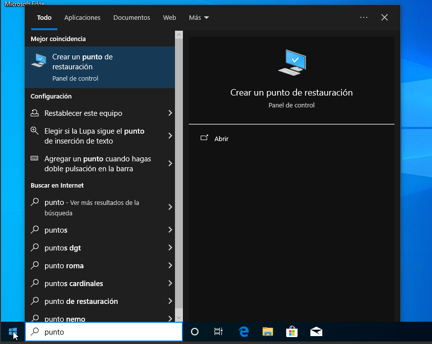
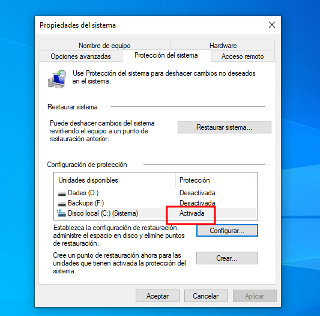
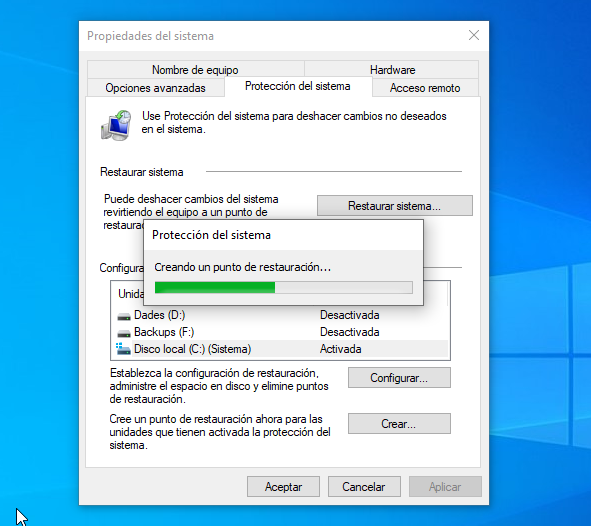
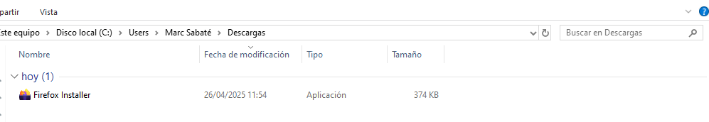
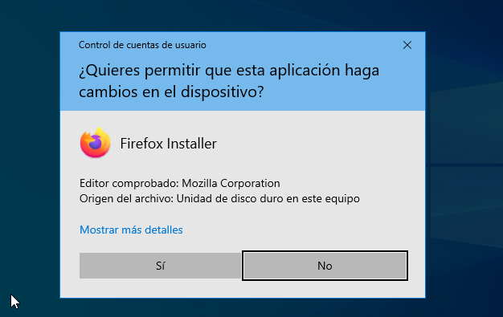

Punts de restauració i aplicacions
- Punts de restauració
Per crear punts de restauració Windows disposa d'una eina gràfica que ens permet guardar l'estat d'un disc en el moment en que es realitza. Primerament, obrirem aquesta eina i a la configuració activarem la protecció del sistema tal com es mostra. 

[!09](img/puntrestw1.png)

Un cop fet això veurem que ja s'ha quedat activada la protecció del disc C, i podrem seguir creant el punt de restauració, amb l'opció crear.

Ara ja tenim el punt de restaurció creat i per tal de comprovar el seu funcionament instal·larem alguna aplicació per fer canvis al disc.

Seguidament al panell de control a la part de "programas y caracteristicas" podem consultar tots els programes i aplicacions que hi ha instal·lats al nostre sistema. Com es pot veure el Firefox esta instal·lat.
[09](img/puntrestw7.png)

Finalment, recuperarem l'estat anterior del sistema a partir del punt de restauració que s'ha fet prèviament. Per fer això tornarem a la configuració dels punts de restauració i anirem a l'apartat de "restaurar sistema", allà se'ns obrirà una nova finestra on escollirem el punt de restauració, si el seleccionem i continuem, començara la restauració.
[09](img/puntrestw8.png)

[09](img/puntrestw9.png)

[09](img/puntrestw10.png) 

Una vegada s'ha reiniciat l'equip es mostrarà un missatge de que la restauració ha sigut completada i llavors mirarem si el Firefox ja no hi es.

[09](img/puntrestw11.png)

[09](img/puntrestw12.png)

