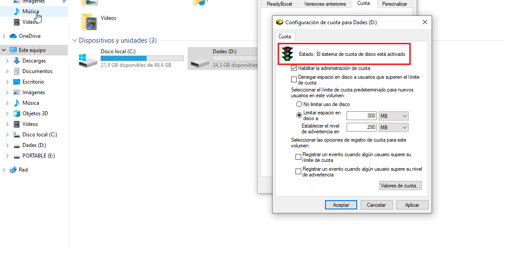
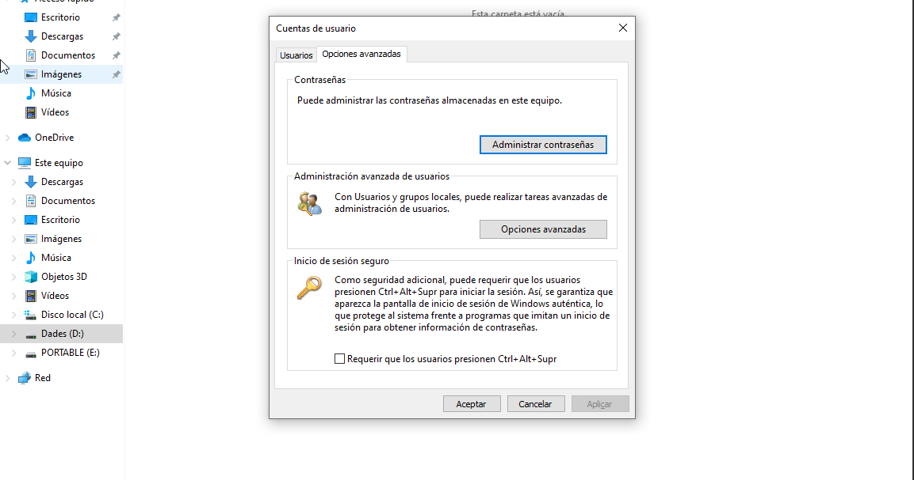
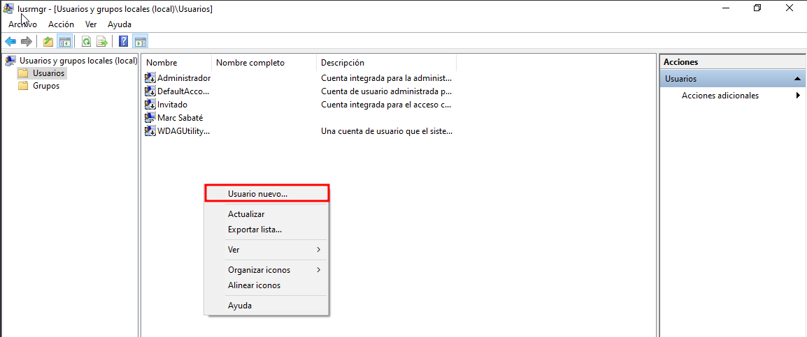

P2 S2
En aquest segon sprint veurem com gestionar i configurar usuaris i grups, establint els permisos i accessos adequats per a cada situació. També administrarem el sistema d'emmagatzematge i veurem com automatitzar algunes tasques a l'hora d'iniciar sessió amb els diferents usuaris.

Quotes i usuaris
En primer lloc, afegirem un disc nou a la nostra màquina per fer proves. Com ja hem vist altres vegades, a la pestanya d'emmagatzematge afegirem un disc nou. Després, arrancarem el sistema de gestor de discs de Windows i configurarem dues particions: una amb el format NTFS que es dirà "Dades" i l'altra amb FAT32 que es dirà "Portable".

Finalment, per comprovar si hem creat correctament aquestes particions des del terminal de comandes CMD, executarem la comanda diskpart i podrem llistar els discs i els volums per comprovar el seu format i mida.

- Quotes
Per continuar, anirem a l'explorador d'arxius i allà, amb el botó dret damunt del disc D que hem anomenat "Dades", obrirem les propietats i, a la pestanya "Quota", obrirem la configuració avançada.

Seguidament, a la configuració habilitarem l'administració de quotes i limitarem l'espai del disc a 300 MB i un avís a 290 MB. També, si volguéssim, podríem denegar que l'usuari pogués superar aquest límit. I, per últim, activarem les opcions de registre. Un cop activada la configuració, ens sortirà la llum del semàfor en verd i un missatge del seu estat.

- Usuaris
A continuació, i després de configurar la quota, procedirem a la creació dels usuaris. Per a això, obrirem l'aplicació "cuentas de usuario" i, a les opcions avançades, configurarem la creació d'aquests.

A més a més, veurem que se'ns obre l'aplicació lusrmgr, on podem configurar els usuaris i grups del sistema local. Per tant, escollim la carpeta dels usuaris i, amb el botó dret, afegim un usuari nou. Com que volem crear dos alumnes, afegirem tant l'alumne 1 com el 2, tal com es mostra.

Tant bon punt acabem la creació d'aquests usuaris, veurem que ja disposem d'ells per fer les proves.

Finalment, a la secció de grups, afegirem un grup nou tal com hem fet amb els usuaris i en crearem un que es digui "Limitats", que el formaran els dos alumnes creats anteriorment, afegint-los amb l'opció de "Agregar".

Per acabar, comprovarem que puguem iniciar sessió amb els dos i que ens apareguin per poder fer-ho.

Com a prova, amb l'alumne 1 excedirem la mida que poden utilitzar del disc D. L'avís que ens dona és que ha excedit el límit. Ens ha deixat sobrepassar-lo ja que així ho hem configurat.
