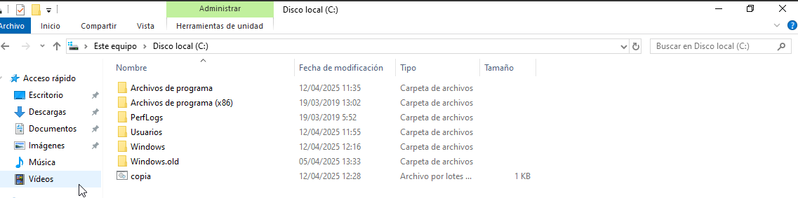

Còpies de seguretat i automatització
Per poder fer les còpies de seguretat afegirem un disc nou d'uns 10GB tal i com hem fet abans. També, amb l'eina de Windows configurarem tot el disc amb el format NTFS i l'anomenarem "Backups".

Seguidament, quan ja haguem formatat el disc, crearem una carpeta anomenada "CòpiesUsuaris" (L'accent de la o pot portar a conflictes).

A continuació, farem un script per crear una còpia de la carpeta de cada usuari dins de la nova que hem creat. Per fer un script ho podem fer obrint el bloc de notes i guardant el fitxer com un .bat (IMPORTANT: Encara que el SO estigui amb qualsevol idioma la ruta del disc C ha de ser amb Users i no Usuarios).

Per fer la prova executo l'script amb l'usuari administrador i com es pot veure la carpeta es crea correctament.

Un cop tenim l'script fet volem que aquest s'executi cada cop que un usuari inici sessió per tant, afegirem l'script a l'aplicació "gpedit", a la qual podem accedir escrivint "gpedit" al cercador de Windows. Un cop allà buscarem la configuració de Windows d'usuaris i dins dels scripts escollirem els d'inici de sessió.

Per comprovar el seu funcionament obrirem la sessió dels dos usuaris i comprovarem que si s'han realitzat les còpies a la carpeta. (Al obrir la sessió veurem que s'obre un terminal, és normal ja que així es realitzen les còpies, quan acabi es tanca sol).

