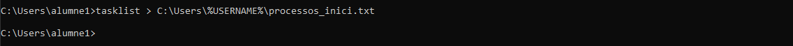
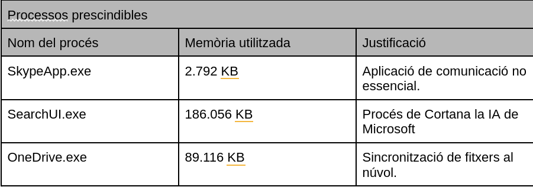
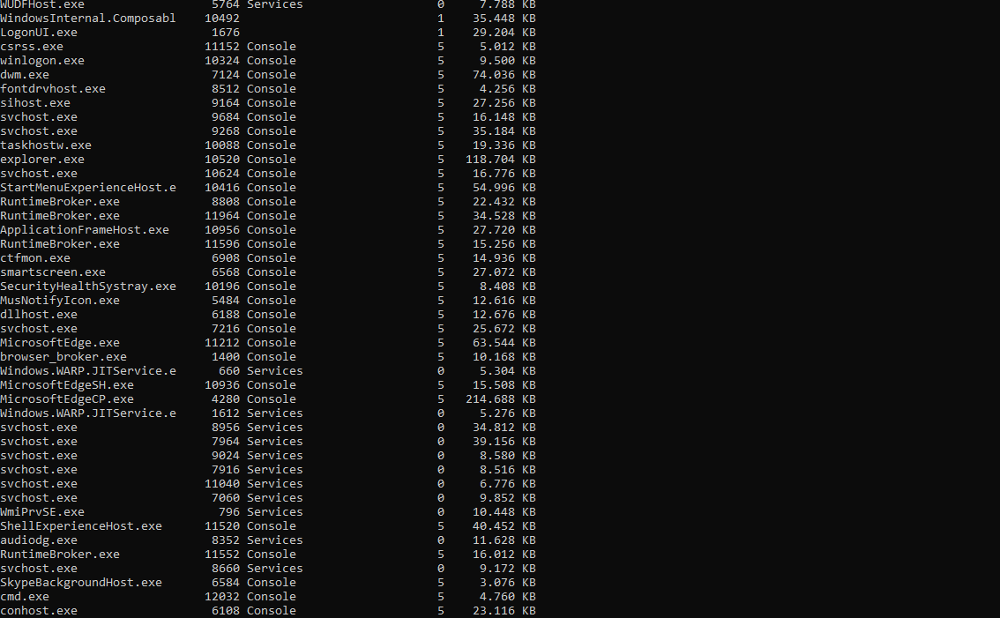
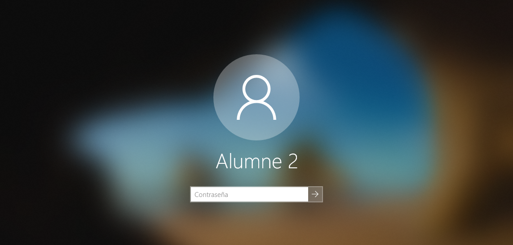
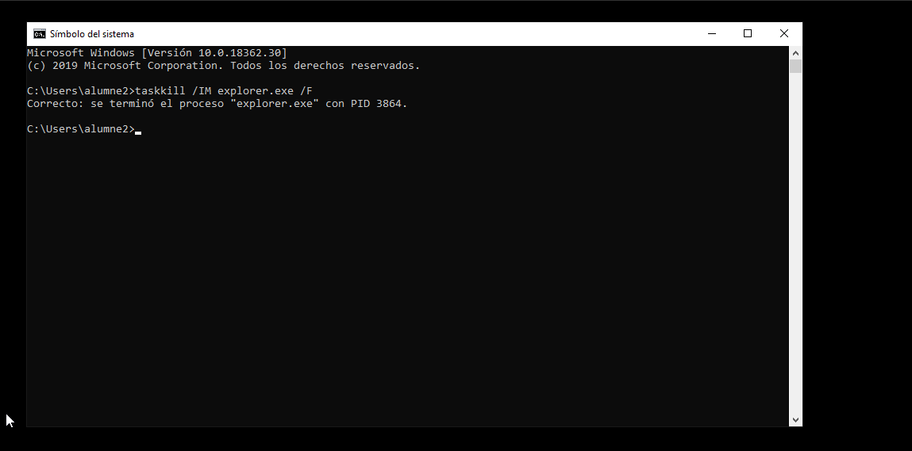
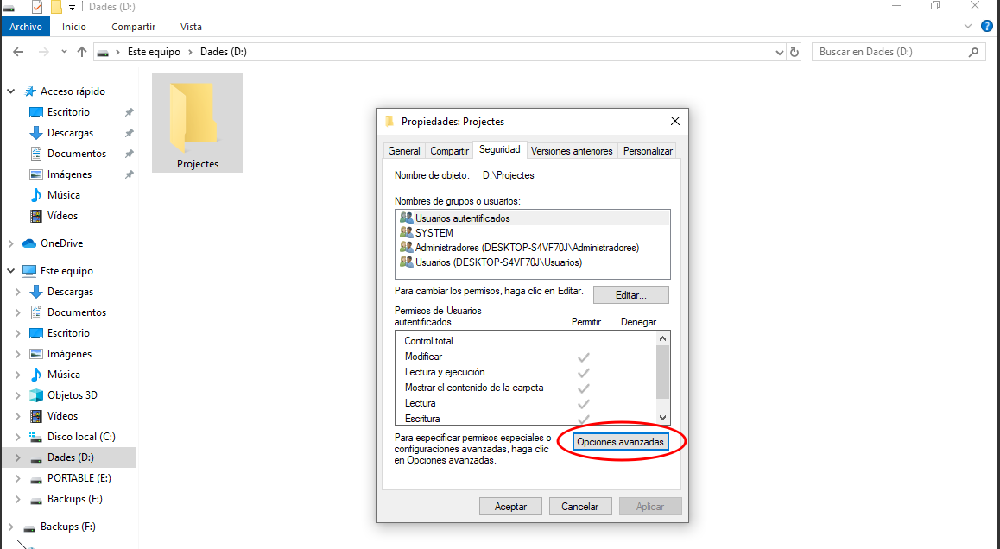
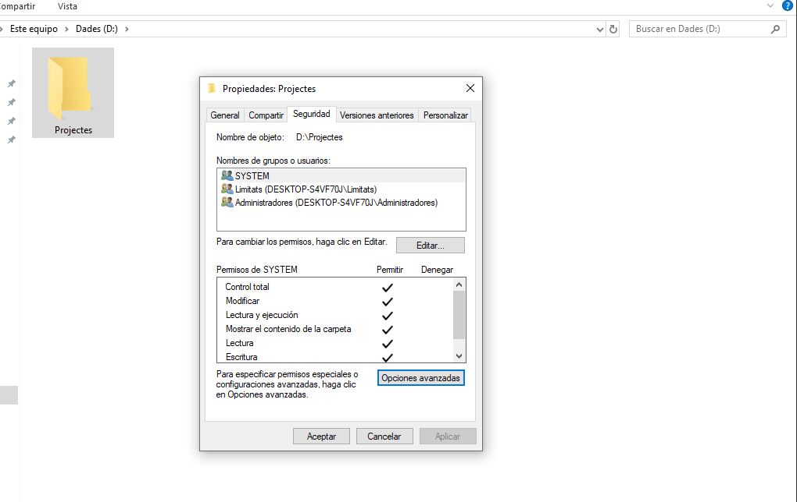
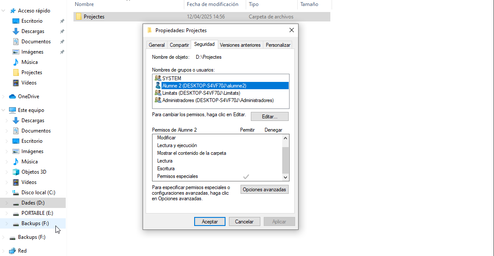

Gestió de processos
El més important amb la gestió de processos de Windows és l'eina tasklist que podem executar des del terminal de comandes (CMD). Aquesta comanda ens llistarà tots els processos que s'estan duent a terme al nostre dispositiu, amb el seu nom, identificador del procés, nom i número de sessió i l'ús de memòria de cadascun.

Si ens interessa podem deixar un registre del que s'està executant en aquell moment en un fitxer de text utilitzant la següent comanda.

tasklist > "ruta on volem guardar l'arxiu\nomarxiu.txt"

Com podem veure dins d'aquests processos hi ha alguns que són prescindibles per l'usuari, com poden ser els d'aplicacions com Skype, One Drive i algunes més. Aquestes poden suposar un malbaratament de recursos del sistema si en disposem de pocs, així que el que farem serà eliminar aquests processos "inútils". Però primer veurem alguns d'aquests i la memòria que utilitzen.

Per matar els processos utilitzarem la comanda

taskkill /IM "nomproces" /F

Com es pot veure a la captura hi ha processos com el de Skype que també tenen un de background que també caldria "matar".

Aquesta manera de matar els processos cada vegada que obrim sessió es pot fer tediosa, per tant, com hem fet abans afegirem això al nostre script d'inici de sessió perquè així cada cop que obrim sessió aquests processos prescindibles morin.
(En aquest cas he creat un script nou incloent les noves comandes) 

Per comprovar el seu funcionament obrirem sessió amb l'alumne 2 i buscarem el procés de One Drive per veure si s'elimina.

I què passaria si matem un procés imprescindible? Doncs passaria el següent i per fer la prova matarem el procés explorer.exe

Aquest procés és el que ens permet navegar a través de l'explorador d'arxius, el que ens mostra l'escriptori i la barra de tasques i també fa de motor gràfic. Llavors matar aquest procés pot semblar la fi del nostre dispositiu. Però no hi ha problema amb la comanda start i el nom del procés el podem tornar a executar. L'únic que haurem de fer és parar més compte amb quins processos matem.

Permisos
Si volem assignar permisos als usuaris que treballaran en certs entorns podem fer-ho de les següents maneres. En aquest cas el que farem serà al disc de "Dades" crear una carpeta anomenada "Projectes" on els usuaris alumne 1 i 2 treballaran.

En primer lloc obrirem les propietats de la carpeta i a la pestanya de seguretat obrirem les opcions avançades.

Després deshabilitarem l'herència i escollirem la primera opció. També a l'opció d'agregar posarem el següent, i esborrarem a tots els usuaris que no siguin l'administrador.

El que estem fent és donar permisos màxims als usuaris del grup Limitats. El resultat hauria de ser semblant a aquest.

Per fer proves entrarem amb l'alumne 1 a la carpeta i crearem un arxiu, l'editarem, l'esborrarem i veurem que podem fer el que vulguem ja que disposem de tots els permisos.

En el cas que vulguem fer alguna excepció, com en aquest cas que l'alumne 2 només pugui llegir, farem uns permisos especials amb la comanda.

icacls "D:\Projectes" /grant:r alumne2:(R)

Per comprovar que només tenim permisos de lectura intentarem crear algun objecte, modificar-lo i esborrar-lo, no podrem fer-ho de cap manera.

